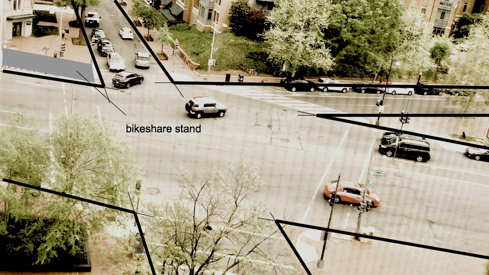
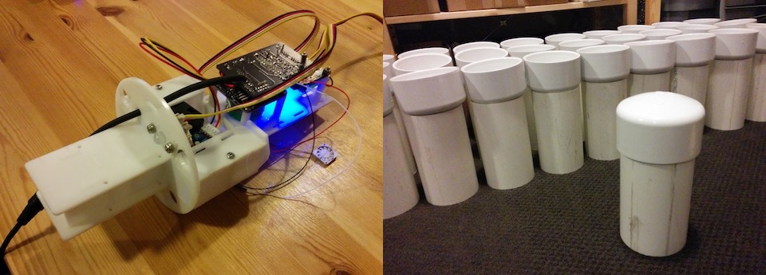
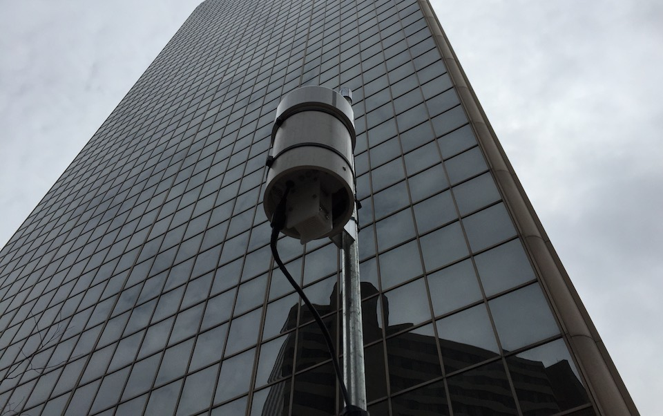

If we start with the assumption that all cities, no matter where on the spectrum of smartness they lie, use data in some form or the other to make decisions, then our definition of smartness depends not so much on data itself but on how decisions are made. In other words, all cities, whether smart or not, use data to make decisions. To what level they use the data to make decisions, and how they make decisions determine their level of smartness.

With the assumption in place, we can begin to categorize cities along a scale of decision-making. I call this the ABCDs of smart cities.

- A: Arbitrary – no apparent plan. Also Analog
- B: Bossy – top-down, Do-Don’t with no recourse to variations
- C: Collaborative – Working together with the citizens
- D: Data-Driven – Using data, typically digital, to drive decision-making and planning
- S: Self-Correcting – Making decisions in reat time, with electromechanical systems that respond to changes in parameters about whom data are collected using ubiquitous sensors

At the very bottom of the scale, the A cities that seem to make decisions completely arbitrarily. By a quirk of A fate, these cities are also likely to be analog cities. Things seem arbitrary, even if they are not, because there is no larger scale, both temporal and geospatial scales, strategic plan in place.

Next are the B cities, that is, the binary cities. These cities make decisions that don’t as much seem arbitrary as they are binary: do this, don’t do that, without much recourse to alternatives. There is a plan but it is top-down, created and implemented by a few to govern the lives of many.

The C cities are the cities that are collaborative in nature. They engage with their citizens to make decisions that affect their lives. The city plans are made with input from the citizens.

The D cities are the ones that depend on large amounts of data to make their decisions. These data also happen to be digital because it is simply easier to collect large amounts of data when they are digital.

Finally, at the top of the ABCDs smartness scale are the S cities that are not only collaborative and depend on digital data, but most importantly, they are self-correcting.

The important thing to note is that a city can display decision-making characteristics across the entire spectrum, from A to S. It can be very smart in some parts, and downright arbitrary in others, while somewhere in between in yet other parts.

An example that always comes to the forefront of my mind whenever I am in a big city is described in my post about the <a href="/Crossroads-Conundrum">Crossroads Conundrum</a>. 

<figure>
    
    <figcaption>25th and Penn and L</figcaption>
</figure>

Looking out my apartment window in downtown Washington DC, I see a perfect example of the crossroads conundrum at the triple intersection of Pennsylvania Avenue, 25th Street, and L Street wherein the wider roads have a much shorter time for the pedestrians to cross them while the narrower roads have much longer time available.  By catering to only cars, and completely neglecting the needs of the pedestrians, DC is exhibiting a type B behavior. 

However, I also see a bike-sharing stand that is built on a framework of open data sharing and mobile apps, and caters to those who still want to bike around the city. This is a behavior spanning the types C and D. Given the peculiarities of systems that depend upon digital data to move physical goods, the bike-sharing system experiences daily imbalance when people in residential areas take all the bikes in the morning and commute to work leaving the bicycles in the commercial district. This leaves the bicycle stands in the residential areas completely empty so those who may want to use a bicycle there for recreational purposes are out of luck. A self-correcting mechanism that informs the central dispatch that a stand is empty and needs to be refilled would help. Of course, as mentioned earlier, given that physical bicycles still need to be picked up from where they are and taken to where they need to be results in a system that is not easily self-correctable.

The thing to keep in mind: real things are highly inefficient. They can’t be moved easily. But we do need them to make our lives, esp. our cities, possible. The “smart bikes” (bike sharing bikes are smarter than regular bikes) are expensive, around $1000 each, because they have a tracker of some sort, a chip, a battery, need to be more robust because of the rough handling by their users who are not their owners, etc. The Chinese companies are trying to disrupt this by dumping really cheap hardware because, well, China. This is not smart because it does create a nuisance, but it is smart because it is pushing the envelope. The citizenry is split into two – the users of these bikes who appreciate the ease of picking up and dropping them off because they can do that anywhere, and the rest of us who are pissed that these scooters and bicycles being left in the middle of the sidewalks are nuisance. Of course, this is a perfect impetus for policy changes that learn from both sides – make transportation easier and more affordable but do so without inconveniencing others.

<figure>
    
    <figcaption>AQ monitor parts</figcaption>
</figure>

A couple of years ago I led a <a href="https://punkish.org/science/sensoredcity/">project on air-quality monitoring</a> in Louisville, KY. We designed and manufactured AQ monitoring stations that could measure PM2.5, CO, temperature, humidity and solar radiation. 

<figure>
    
    <figcaption>AQ monitor installed in downtown Louisville</figcaption>
</figure>

We installed these monitors in downtown Louisville. The monitors transmitted the data wirelessly to a central server from where we downloaded the data in realtime to drive a data-drive sculpture installed on the sidewalk.

<figure>
    
    <figcaption>data-driven sculpture</figcaption>
</figure>

Passers-by could interact with the augmented reality sculpture and learn more about the air they were breathing. This project spanned the types C and D but did not venture into C.

A lot about a city is about moving atoms – picking up trash, local transportation, etc. Every city has to, should do these things, for that would make it a humane city. A humane city would be one that takes care of not just the rich but also the poor and the infirm. If it can do so in a more smart fashion, well, so much the better. And typically, this smartness depends on moving bits – sensors and GPS – that give a realtime picture of what is going on and allow the system to self-correct.

By recognizing specific sub-systems of a city as entitites, we can assign them to one of the ABCDs of smartness. This would provide us with a much more granular way of measuring the performance of the sub-systems and allocating the resources intelligently for the best results. The alternative is too coarse — calling a city smart without any particular distinction on what it is going to do to make the lives of its citizens better and do it in an environmentally sustainable and humane way is just dumb.
