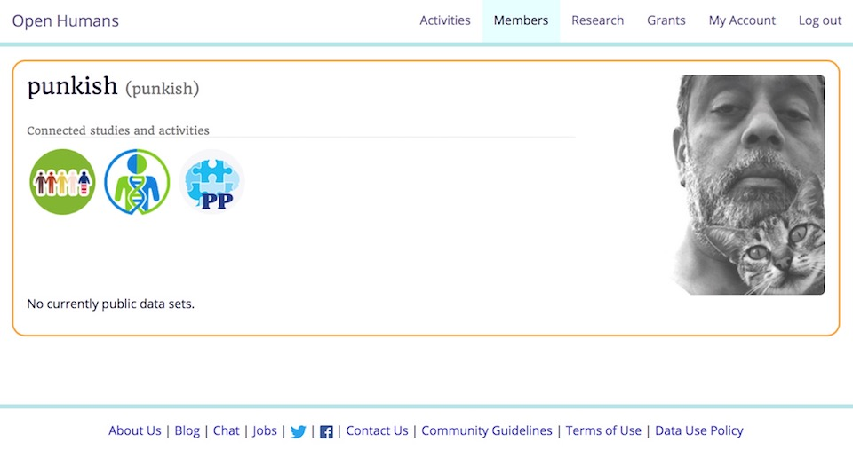
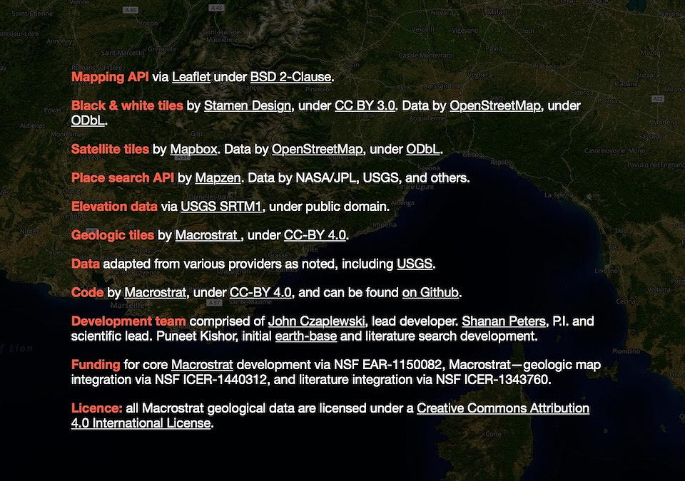
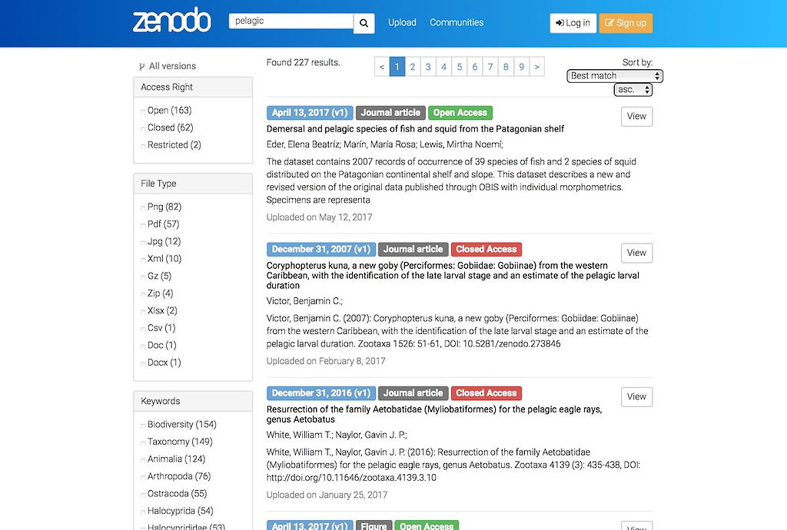
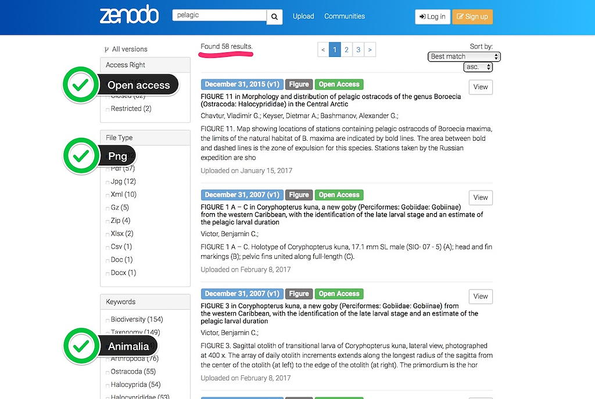
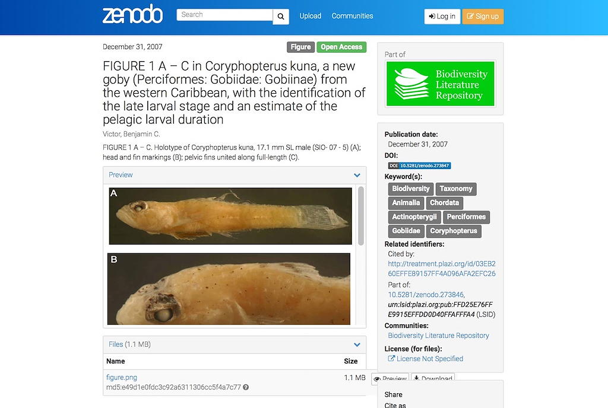
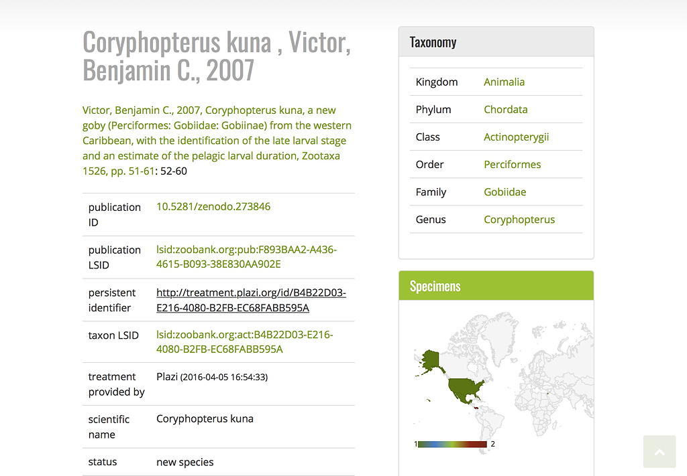

## Scientists have always shared data

--

## But done so very selectively

--

## What is different now?

--

- Scale

--

- Reach

--

- Reusability

--

## All made possible by the internet

---

# Because of the internet

## We can share data easily
### *and should do so*

## We can share data wrongly
### *and should not do so*

---
class: center, middle

# Why Share

---
class: center, middle

<video width="100%" controls>
    <source src="../img/Science-The-Inoculation-Against-Charlatans.mp4" 
        type='video/mp4;codecs="avc1.42E01E, mp4a.40.2"'/>
</video>

---

# Ethical Considerations

## Do the right thing 
### *even if you don’t have to*

## Don’t do the wrong thing 
### *even if you have the right to do it*

---

# Contracts

## A social contract
### *to share data with those who can use it*

## A legal contract to share data correctly
### *and, **where appropriate**, not with those who can misuse it*

## A cultural contract 
### *to maintain norms*

---
class: center, middle

# What to Share

---

## Data, What Data?

<br>

<video width="100%" controls>
    <source src="../img/Jerry-Seinfeld-weather.mp4"
        type='video/mp4;codecs="avc1.42E01E, mp4a.40.2"'/>
</video>

---

## Data, What Data?


---

# Share Meaningful Data
## *or, give others the ability to make their own decision*

---

## Open Humans



---
class: center, middle

# How to Share

---

# How to Share

## Technology
## Law
## Culture

---

background-image: url('/Scalable-Data-Sharing/img/macrostrat-cover.jpg')
background-size: cover
class: center, middle

# Macrostrat

---

## Macrostrat
### Database for geological data.

[Macrostrat](https://macrostrat.org) is a platform for the aggregation and distribution of geological data relevant to the spatial and temporal distribution of sedimentary, igneous, and metamorphic rocks as well as data extracted from them. It aims to become a community resource for the addition, editing, and distribution of new stratigraphic, lithological, environmental, and economic data. Interactive applications built upon Macrostrat are designed for educational and research purposes.

--

A comprehensive relational database currently  containing 1,474 regional rock columns, 33,903 stratigraphic units, 2,050,565 geologic map polygons, and more than 90,000 attributes (radioisotopic ages, lithologies, economic uses, etc.).

--

Macrostrat was originally built to test hypotheses for the correlation between the sedimentary rock and fossil records. It is spatially explicit and chronostratigraphically focused and serves as a scaffolding for organizing and analyzing geological data of all types.

---

## Source of Data

Data are aggregated from multiple published and online sources, including those from the Geological Survey of Canada, the United States Geological Survey, and the AAPG.

---

## Credits

### Scientific norms *and* legal requirement



---

## Data are CC BY 4.0


---

## Macrostrat Burwell

### [What is at a point lat 51.5115, lng 10.2242?](https://macrostrat.org/burwell/#11/51.5115/10.2242)


---

## Macrostrat Burwell

Query data

[https://macrostrat.org/api/v2/geologic_units/burwell?lat=51.5115&lng=10.2242]()

```json
{"success":{
    "v":2,
    "license":"CC-BY 4.0",
    "data":[
        {
            "map_id":2603155,
            "source_id":94,
            "name":"",
            "strat_name":"",
            "lith":"Silt; fine-sandy, clayey, in parts increasingly calcareous downwards",
            "descrip":"loess (aeolian) loess loam",
            "comments":"Loess, loess loam and other loess derivatives, often above older loesses",
            "macro_units":[],
            "strat_names":[],
            "liths":[4],
            "t_int_id":4,
            "t_int_age":0.0117,
            "t_int_name":"Pleistocene",
            "b_int_id":4,
            "b_int_age":2.588,
            "b_int_name":"Pleistocene",
            "color":"#FFF2AE",
            "t_age":0.0117,
            "b_age":2.588,
            "best_int_name":"Pleistocene"
        },
        {
            "map_id":1382032,
            "source_id":18,
            "name":"Triassic sedimentary rocks",
            "strat_name":"",
            "lith":"sedimentary rocks",
            "descrip":"",
            "comments":"",
            "macro_units":[],
            "strat_names":[],
            "liths":[111],
            "t_int_id":63,
            "t_int_age":201.3,
            "t_int_name":"Triassic",
            "b_int_id":63,
            "b_int_age":252.17,
            "b_int_name":"Triassic",
            "color":"#812B92",
            "t_age":201.3,
            "b_age":252.17,
            "best_int_name":"Triassic"
        }
    ],
    "refs":{
        "18":"Geological Survey of Canada. Generalized geological map of the world and linked databases. doi:10.4095/195142. Open File 2915d. ",
        "94":"Toloczyki, M., P. Trurnit, A. Voges, H. Wittekindt, A. Zitzmann. Geological Map of Germany 1:M. Bundesanstalt für Geowissenschaften und Rohstoffe. "
    }
}}
```

---

## Macrostrat Burwell

### [elevation profile between two points lat 51.5113, lng 10.1256](https://macrostrat.org/burwell/#11/51.5113/10.1256)


---

## Macrostrat Burwell

Elevation profile data

[https://macrostrat.org/api/v2/elevation?start_lng=10.05867&start_lat=51.48395&end_lng=10.24063&end_lat=51.56896]()

```json
{"success":{
    "v":2,
    "license":"CC-BY 4.0",
    "data":[
        {"lng":10.05867,"lat":51.48395,"d":0,"elevation":227},
        {"lng":10.0595798,"lat":51.48437505,"d":0.08,"elevation":219},
        {"lng":10.0604896,"lat":51.4848001,"d":0.16,"elevation":207},
        {"lng":10.0613994,"lat":51.48522515,"d":0.24,"elevation":222},
        {"lng":10.0623092,"lat":51.4856502,"d":0.32,"elevation":238},
        {"lng":10.063219,"lat":51.48607525,"d":0.39,"elevation":237},
        {"lng":10.0641288,"lat":51.4865003,"d":0.47,"elevation":237},
        {"lng":10.0650386,"lat":51.48692535,"d":0.55,"elevation":236},
        {"lng":10.0659484,"lat":51.4873504,"d":0.63,"elevation":226},
        {"lng":10.0668582,"lat":51.48777545,"d":0.71,"elevation":220},
        {"lng":10.067768,"lat":51.4882005,"d":0.79,"elevation":215},
        {"lng":10.0686778,"lat":51.48862555,"d":0.87,"elevation":208},
        {"lng":10.0695876,"lat":51.4890506,"d":0.95,"elevation":208},
        {"lng":10.0704974,"lat":51.48947565,"d":1.02,"elevation":207},
        {"lng":10.0714072,"lat":51.4899007,"d":1.1,"elevation":203},
        {"lng":10.072317,"lat":51.49032575,"d":1.18,"elevation":209},
        {"lng":10.0732268,"lat":51.4907508,"d":1.26,"elevation":212},
        {"lng":10.0741366,"lat":51.49117585,"d":1.34,"elevation":216},
        {"lng":10.0750464,"lat":51.4916009,"d":1.42,"elevation":231},
        {"lng":10.0759562,"lat":51.49202595,"d":1.5,"elevation":248},
        {"lng":10.076866,"lat":51.492451,"d":1.58,"elevation":269},
        {"lng":10.0777758,"lat":51.49287605,"d":1.65,"elevation":283},
        {"lng":10.0786856,"lat":51.4933011,"d":1.73,"elevation":285},
        {"lng":10.0795954,"lat":51.49372615,"d":1.81,"elevation":284},
        {"lng":10.0805052,"lat":51.4941512,"d":1.89,"elevation":284},
        {"lng":10.081415,"lat":51.49457625,"d":1.97,"elevation":288},
        {"lng":10.0823248,"lat":51.4950013,"d":2.05,"elevation":288},
		{"lng":10.0832346,"lat":51.49542635,"d":2.13,"elevation":279},
		{"lng":10.0841444,"lat":51.4958514,"d":2.21,"elevation":277},
		{"lng":10.0850542,"lat":51.49627645,"d":2.28,"elevation":274},
		{"lng":10.085964,"lat":51.4967015,"d":2.36,"elevation":273},
		{"lng":10.0868738,"lat":51.49712655,"d":2.44,"elevation":268},
		{"lng":10.0877836,"lat":51.4975516,"d":2.52,"elevation":266},
		{"lng":10.0886934,"lat":51.49797665,"d":2.6,"elevation":265},
		{"lng":10.0896032,"lat":51.4984017,"d":2.68,"elevation":262},
		{"lng":10.090513,"lat":51.49882675,"d":2.76,"elevation":257},
		{"lng":10.0914228,"lat":51.4992518,"d":2.83,"elevation":254},
		{"lng":10.0923326,"lat":51.49967685,"d":2.91,"elevation":250},
		{"lng":10.0932424,"lat":51.5001019,"d":2.99,"elevation":249},
		{"lng":10.0941522,"lat":51.50052695,"d":3.07,"elevation":248},
		{"lng":10.095062,"lat":51.500952,"d":3.15,"elevation":247},
		{"lng":10.0959718,"lat":51.50137705,"d":3.23,"elevation":245},
		{"lng":10.0968816,"lat":51.5018021,"d":3.31,"elevation":243},
		{"lng":10.0977914,"lat":51.50222715,"d":3.39,"elevation":241},
		{"lng":10.0987012,"lat":51.5026522,"d":3.46,"elevation":241},
		{"lng":10.099611,"lat":51.50307725,"d":3.54,"elevation":239},
		{"lng":10.1005208,"lat":51.5035023,"d":3.62,"elevation":237},
		{"lng":10.1014306,"lat":51.50392735,"d":3.7,"elevation":235},
		{"lng":10.1023404,"lat":51.5043524,"d":3.78,"elevation":233},
		{"lng":10.1032502,"lat":51.50477745,"d":3.86,"elevation":230},
		{"lng":10.10416,"lat":51.5052025,"d":3.94,"elevation":229},
		{"lng":10.1050698,"lat":51.50562755,"d":4.02,"elevation":226},
		{"lng":10.1059796,"lat":51.5060526,"d":4.09,"elevation":228},
		{"lng":10.1068894,"lat":51.50647765,"d":4.17,"elevation":228},
		{"lng":10.1077992,"lat":51.5069027,"d":4.25,"elevation":226},
		{"lng":10.108709,"lat":51.50732775,"d":4.33,"elevation":228},
		{"lng":10.1096188,"lat":51.5077528,"d":4.41,"elevation":231},
		{"lng":10.1105286,"lat":51.50817785,"d":4.49,"elevation":233},
		{"lng":10.1114384,"lat":51.5086029,"d":4.57,"elevation":232},
		{"lng":10.1123482,"lat":51.50902795,"d":4.65,"elevation":232},
		{"lng":10.113258,"lat":51.509453,"d":4.72,"elevation":231},
		{"lng":10.1141678,"lat":51.50987805,"d":4.8,"elevation":234},
		{"lng":10.1150776,"lat":51.5103031,"d":4.88,"elevation":237},
		{"lng":10.1159874,"lat":51.51072815,"d":4.96,"elevation":241},
		{"lng":10.1168972,"lat":51.5111532,"d":5.04,"elevation":242},
		{"lng":10.117807,"lat":51.51157825,"d":5.12,"elevation":243},
		{"lng":10.1187168,"lat":51.5120033,"d":5.2,"elevation":242},
		{"lng":10.1196266,"lat":51.51242835,"d":5.28,"elevation":244},
		{"lng":10.1205364,"lat":51.5128534,"d":5.35,"elevation":246},
		{"lng":10.1214462,"lat":51.51327845,"d":5.43,"elevation":249},
		{"lng":10.122356,"lat":51.5137035,"d":5.51,"elevation":257},
		{"lng":10.1232658,"lat":51.51412855,"d":5.59,"elevation":260},
		{"lng":10.1241756,"lat":51.5145536,"d":5.67,"elevation":259},
		{"lng":10.1250854,"lat":51.51497865,"d":5.75,"elevation":260},
		{"lng":10.1259952,"lat":51.5154037,"d":5.83,"elevation":260},
		{"lng":10.126905,"lat":51.51582875,"d":5.91,"elevation":255},
		{"lng":10.1278148,"lat":51.5162538,"d":5.98,"elevation":251},
		{"lng":10.1287246,"lat":51.51667885,"d":6.06,"elevation":250},
		{"lng":10.1296344,"lat":51.5171039,"d":6.14,"elevation":255},
		{"lng":10.1305442,"lat":51.51752895,"d":6.22,"elevation":260},
		{"lng":10.131454,"lat":51.517954,"d":6.3,"elevation":265},
		{"lng":10.1323638,"lat":51.51837905,"d":6.38,"elevation":268},
		{"lng":10.1332736,"lat":51.5188041,"d":6.46,"elevation":270},
		{"lng":10.1341834,"lat":51.51922915,"d":6.54,"elevation":271},
		{"lng":10.1350932,"lat":51.5196542,"d":6.61,"elevation":272},
		{"lng":10.136003,"lat":51.52007925,"d":6.69,"elevation":271},
		{"lng":10.1369128,"lat":51.5205043,"d":6.77,"elevation":272},
		{"lng":10.1378226,"lat":51.52092935,"d":6.85,"elevation":270},
		{"lng":10.1387324,"lat":51.5213544,"d":6.93,"elevation":275},
		{"lng":10.1396422,"lat":51.52177945,"d":7.01,"elevation":279},
		{"lng":10.140552,"lat":51.5222045,"d":7.09,"elevation":265},
		{"lng":10.1414618,"lat":51.52262955,"d":7.16,"elevation":248},
		{"lng":10.1423716,"lat":51.5230546,"d":7.24,"elevation":243},
		{"lng":10.1432814,"lat":51.52347965,"d":7.32,"elevation":266},
		{"lng":10.1441912,"lat":51.5239047,"d":7.4,"elevation":283},
		{"lng":10.145101,"lat":51.52432975,"d":7.48,"elevation":289},
		{"lng":10.1460108,"lat":51.5247548,"d":7.56,"elevation":292},
		{"lng":10.1469206,"lat":51.52517985,"d":7.64,"elevation":297},
		{"lng":10.1478304,"lat":51.5256049,"d":7.72,"elevation":294},
		{"lng":10.1487402,"lat":51.52602995,"d":7.79,"elevation":288},
		{"lng":10.14965,"lat":51.526455,"d":7.87,"elevation":286},
		{"lng":10.1505598,"lat":51.52688005,"d":7.95,"elevation":272},
		{"lng":10.1514696,"lat":51.5273051,"d":8.03,"elevation":246},
		{"lng":10.1523794,"lat":51.52773015,"d":8.11,"elevation":232},
		{"lng":10.1532892,"lat":51.5281552,"d":8.19,"elevation":221},
		{"lng":10.154199,"lat":51.52858025,"d":8.27,"elevation":215},
		{"lng":10.1551088,"lat":51.5290053,"d":8.35,"elevation":205},
		{"lng":10.1560186,"lat":51.52943035,"d":8.42,"elevation":193},
		{"lng":10.1569284,"lat":51.5298554,"d":8.5,"elevation":190},
		{"lng":10.1578382,"lat":51.53028045,"d":8.58,"elevation":183},
		{"lng":10.158748,"lat":51.5307055,"d":8.66,"elevation":180},
		{"lng":10.1596578,"lat":51.53113055,"d":8.74,"elevation":180},
		{"lng":10.1605676,"lat":51.5315556,"d":8.82,"elevation":178},
		{"lng":10.1614774,"lat":51.53198065,"d":8.9,"elevation":179},
		{"lng":10.1623872,"lat":51.5324057,"d":8.98,"elevation":177},
		{"lng":10.163297,"lat":51.53283075,"d":9.05,"elevation":176},
		{"lng":10.1642068,"lat":51.5332558,"d":9.13,"elevation":176},
		{"lng":10.1651166,"lat":51.53368085,"d":9.21,"elevation":175},
		{"lng":10.1660264,"lat":51.5341059,"d":9.29,"elevation":180},
		{"lng":10.1669362,"lat":51.53453095,"d":9.37,"elevation":183},
		{"lng":10.167846,"lat":51.534956,"d":9.45,"elevation":180},
		{"lng":10.1687558,"lat":51.53538105,"d":9.53,"elevation":179},
		{"lng":10.1696656,"lat":51.5358061,"d":9.6,"elevation":179},
		{"lng":10.1705754,"lat":51.53623115,"d":9.68,"elevation":183},
		{"lng":10.1714852,"lat":51.5366562,"d":9.76,"elevation":185},
		{"lng":10.172395,"lat":51.53708125,"d":9.84,"elevation":187},
		{"lng":10.1733048,"lat":51.5375063,"d":9.92,"elevation":184},
		{"lng":10.1742146,"lat":51.53793135,"d":10,"elevation":181},
		{"lng":10.1751244,"lat":51.5383564,"d":10.08,"elevation":179},
		{"lng":10.1760342,"lat":51.53878145,"d":10.16,"elevation":182},
		{"lng":10.176944,"lat":51.5392065,"d":10.23,"elevation":185},
		{"lng":10.1778538,"lat":51.53963155,"d":10.31,"elevation":185},
		{"lng":10.1787636,"lat":51.5400566,"d":10.39,"elevation":183},
		{"lng":10.1796734,"lat":51.54048165,"d":10.47,"elevation":183},
		{"lng":10.1805832,"lat":51.5409067,"d":10.55,"elevation":182},
		{"lng":10.181493,"lat":51.54133175,"d":10.63,"elevation":185},
		{"lng":10.1824028,"lat":51.5417568,"d":10.71,"elevation":186},
		{"lng":10.1833126,"lat":51.54218185,"d":10.79,"elevation":186},
		{"lng":10.1842224,"lat":51.5426069,"d":10.86,"elevation":186},
		{"lng":10.1851322,"lat":51.54303195,"d":10.94,"elevation":187},
		{"lng":10.186042,"lat":51.543457,"d":11.02,"elevation":187},
		{"lng":10.1869518,"lat":51.54388205,"d":11.1,"elevation":188},
		{"lng":10.1878616,"lat":51.5443071,"d":11.18,"elevation":188},
		{"lng":10.1887714,"lat":51.54473215,"d":11.26,"elevation":189},
		{"lng":10.1896812,"lat":51.5451572,"d":11.34,"elevation":189},
		{"lng":10.190591,"lat":51.54558225,"d":11.41,"elevation":190},
		{"lng":10.1915008,"lat":51.5460073,"d":11.49,"elevation":189},
		{"lng":10.1924106,"lat":51.54643235,"d":11.57,"elevation":187},
		{"lng":10.1933204,"lat":51.5468574,"d":11.65,"elevation":184},
		{"lng":10.1942302,"lat":51.54728245,"d":11.73,"elevation":185},
		{"lng":10.19514,"lat":51.5477075,"d":11.81,"elevation":186},
		{"lng":10.1960498,"lat":51.54813255,"d":11.89,"elevation":185},
		{"lng":10.1969596,"lat":51.5485576,"d":11.97,"elevation":183},
		{"lng":10.1978694,"lat":51.54898265,"d":12.04,"elevation":184},
		{"lng":10.1987792,"lat":51.5494077,"d":12.12,"elevation":181},
		{"lng":10.199689,"lat":51.54983275,"d":12.2,"elevation":184},
		{"lng":10.2005988,"lat":51.5502578,"d":12.28,"elevation":190},
		{"lng":10.2015086,"lat":51.55068285,"d":12.36,"elevation":194},
		{"lng":10.2024184,"lat":51.5511079,"d":12.44,"elevation":194},
		{"lng":10.2033282,"lat":51.55153295,"d":12.52,"elevation":191},
		{"lng":10.204238,"lat":51.551958,"d":12.6,"elevation":187},
		{"lng":10.2051478,"lat":51.55238305,"d":12.67,"elevation":183},
		{"lng":10.2060576,"lat":51.5528081,"d":12.75,"elevation":178},
		{"lng":10.2069674,"lat":51.55323315,"d":12.83,"elevation":174},
		{"lng":10.2078772,"lat":51.5536582,"d":12.91,"elevation":171},
		{"lng":10.208787,"lat":51.55408325,"d":12.99,"elevation":168},
		{"lng":10.2096968,"lat":51.5545083,"d":13.07,"elevation":166},
		{"lng":10.2106066,"lat":51.55493335,"d":13.15,"elevation":163},
		{"lng":10.2115164,"lat":51.5553584,"d":13.22,"elevation":163},
		{"lng":10.2124262,"lat":51.55578345,"d":13.3,"elevation":161},
		{"lng":10.213336,"lat":51.5562085,"d":13.38,"elevation":159},
		{"lng":10.2142458,"lat":51.55663355,"d":13.46,"elevation":159},
		{"lng":10.2151556,"lat":51.5570586,"d":13.54,"elevation":158},
		{"lng":10.2160654,"lat":51.55748365,"d":13.62,"elevation":159},
		{"lng":10.2169752,"lat":51.5579087,"d":13.7,"elevation":159},
		{"lng":10.217885,"lat":51.55833375,"d":13.78,"elevation":160},
		{"lng":10.2187948,"lat":51.5587588,"d":13.85,"elevation":158},
		{"lng":10.2197046,"lat":51.55918385,"d":13.93,"elevation":158},
		{"lng":10.2206144,"lat":51.5596089,"d":14.01,"elevation":156},
		{"lng":10.2215242,"lat":51.56003395,"d":14.09,"elevation":156},
		{"lng":10.222434,"lat":51.560459,"d":14.17,"elevation":155},
		{"lng":10.2233438,"lat":51.56088405,"d":14.25,"elevation":155},
		{"lng":10.2242536,"lat":51.5613091,"d":14.33,"elevation":155},
		{"lng":10.2251634,"lat":51.56173415,"d":14.4,"elevation":155},
		{"lng":10.2260732,"lat":51.5621592,"d":14.48,"elevation":159},
		{"lng":10.226983,"lat":51.56258425,"d":14.56,"elevation":159},
		{"lng":10.2278928,"lat":51.5630093,"d":14.64,"elevation":158},
		{"lng":10.2288026,"lat":51.56343435,"d":14.72,"elevation":157},
		{"lng":10.2297124,"lat":51.5638594,"d":14.8,"elevation":158},
		{"lng":10.2306222,"lat":51.56428445,"d":14.88,"elevation":160},
		{"lng":10.231532,"lat":51.5647095,"d":14.96,"elevation":163},
		{"lng":10.2324418,"lat":51.56513455,"d":15.03,"elevation":166},
		{"lng":10.2333516,"lat":51.5655596,"d":15.11,"elevation":173},
		{"lng":10.2342614,"lat":51.56598465,"d":15.19,"elevation":180},
		{"lng":10.2351712,"lat":51.5664097,"d":15.27,"elevation":188},
		{"lng":10.236081,"lat":51.56683475,"d":15.35,"elevation":194},
		{"lng":10.2369908,"lat":51.5672598,"d":15.43,"elevation":195},
		{"lng":10.2379006,"lat":51.56768485,"d":15.51,"elevation":189},
		{"lng":10.2388104,"lat":51.5681099,"d":15.58,"elevation":188},
		{"lng":10.2397202,"lat":51.56853495,"d":15.66,"elevation":200},
		{"lng":10.24063,"lat":51.56896,"d":15.74,"elevation":206}
    ]
}}
```

---

## Macrostrat Sift

### Columns of Type “Organic” https://macrostrat.org/api/columns?lith_type=organic

```json
{"success":{
    "v":2,"license":"CC-BY 4.0",
    "data":[
        {"col_id":1169,"col_name":"Cuba S.E. (Baracoa Purial)","col_group":"Caribbean Islands","col_group_id":27,"group_col_id":"7.00","col_area":"33768.3","project_id":7,"refs":[6]},
        {"col_id":502,"col_name":"Western Uinta Basin","col_group":"CSR","col_group_id":3,"group_col_id":"16.00","col_area":"20528.3","project_id":1,"refs":[1]},
        …
    ],
    "refs":{
        "1":"Childs, O.E. Correlation of stratigraphic units of North America; COSUNA. AAPG Bulletin 69:173-180. 1985. ",
        "2":"Douglas, R.J.W. Geology and economic minerals of Canada. Geological Survey of Canada Economic Geology Report No. 1. 1970. ",
        "3":"Dockery, D.T. Stratigraphic Units of Mississippi. Mississippi Department of Environmental Quality. 2008. http://deq.state.ms.us/MDEQ.nsf/page/Geology_surface. ",
        …
    }
}}
```

---

## Biodiversity Literature Repository

https://zenodo.org/search?page=1&size=20&q=pelagic



---

## Biodiversity Literature Repository

https://zenodo.org/search?page=1&size=20&q=pelagic&access_right=open&file_type=png&keywords=animalia&type=image&subtype=figure



---

## Biodiversity Literature Repository

[https://zenodo.org/record/273847]()



---

## Biodiversity Literature Repository

[https://zenodo.org/api/records/273847]()

```json
{
  "conceptrecid": "751226", 
  "created": "2017-02-08T11:00:11.003162+00:00", 
  "doi": "10.5281/zenodo.273847", 
  "id": 273847, 
  "links": {
    "badge": "https://zenodo.org/badge/doi/10.5281/zenodo.273847.svg", 
    "bucket": "https://zenodo.org/api/files/ee2334a0-dba2-44b1-9ce8-d4a6fa36e8d7", 
    "doi": "https://doi.org/10.5281/zenodo.273847", 
    "html": "https://zenodo.org/record/273847", 
    "latest": "https://zenodo.org/api/records/273847", 
    "latest_html": "https://zenodo.org/record/273847", 
    "self": "https://zenodo.org/api/records/273847"
  }, 
  "metadata": {
    "access_right": "open", 
    "access_right_category": "success", 
    "communities": [
      {
        "id": "biosyslit"
      }
    ], 
    "creators": [
      {
        "name": "Victor, Benjamin C."
      }
    ], 
    "description": "FIGURE 1 A \u2013 C. Holotype of Coryphopterus kuna, 17.1 mm SL male (SIO- 07 - 5) (A); head and fin markings (B); pelvic fins united along full-length (C).", 
    "doi": "10.5281/zenodo.273847", 
    "keywords": [
      "Biodiversity", 
      "Taxonomy", 
      "Animalia", 
      "Chordata", 
      "Actinopterygii", 
      "Perciformes", 
      "Gobiidae", 
      "Coryphopterus"
    ], 
    "license": {
      "id": "notspecified"
    }, 
    "publication_date": "2007-12-31", 
    "related_identifiers": [
      {
        "identifier": "http://treatment.plazi.org/id/03EB260EFFE89157FF4A096AFA2EFC26", 
        "relation": "isCitedBy", 
        "scheme": "url"
      }, 
      {
        "identifier": "10.5281/zenodo.273846", 
        "relation": "isPartOf", 
        "scheme": "doi"
      }, 
      {
        "identifier": "urn:lsid:plazi.org:pub:FFD25E76FFE9915EFFDD0D40FFAFFFA4", 
        "relation": "isPartOf", 
        "scheme": "lsid"
      }
    ], 
    "relations": {
      "version": [
        {
          "count": 1, 
          "index": 0, 
          "is_last": true, 
          "last_child": {
            "pid_type": "recid", 
            "pid_value": "273847"
          }, 
          "parent": {
            "pid_type": "recid", 
            "pid_value": "751226"
          }
        }
      ]
    }, 
    "resource_type": {
      "subtype": "figure", 
      "title": "Figure", 
      "type": "image"
    }, 
    "title": "FIGURE 1 A \u2013 C in Coryphopterus kuna, a new goby (Perciformes: Gobiidae: Gobiinae) from the western Caribbean, with the identification of the late larval stage and an estimate of the pelagic larval duration"
  }, 
  "owners": [
    1161
  ], 
  "revision": 2, 
  "updated": "2017-09-08T08:34:34.686118+00:00"
}
```
---

## TreatmentBank


---

## TreatmentBank

[http://treatment.plazi.org/id/03EB260EFFE89157FF4A096AFA2EFC26]()



---


<h1 class="h1-byline">The Plan</h1>
<h2 class="h2-byline">“If you put your mind to it, you can accomplish anything.”</h2>

--

### Treat data as code

--

### Learn how to code
### *or get help from someone who knows*

--

- Make sure your data are structured

--

- Make sure the data format is free and open

--

- Add URIs to identifiable things

--

- Link to other data where possible

--

- Publish your data online under an open license

---

## Don’t be a Charlatan, Share

<br>

**charlatan** | <span class="byline">ˈSHärlədən, ˈSHärlətn</span> |  
noun  
a person falsely claiming to have a special knowledge or skill; a fraud.  

DERIVATIVES  
<hr>
charlatanism | <span class="byline">ˈSHärlədəˌnizəm, ˈSHärlətnˌizəm</span> | noun  
charlatanry | <span class="byline">ˈSHärlətənrē, -lətnrē</span> | noun  

ORIGIN
<hr>
early 17th century (denoting an itinerant seller of supposed remedies): from French, from Italian ***ciarlatano***, from ***ciarlare*** ‘to babble’.