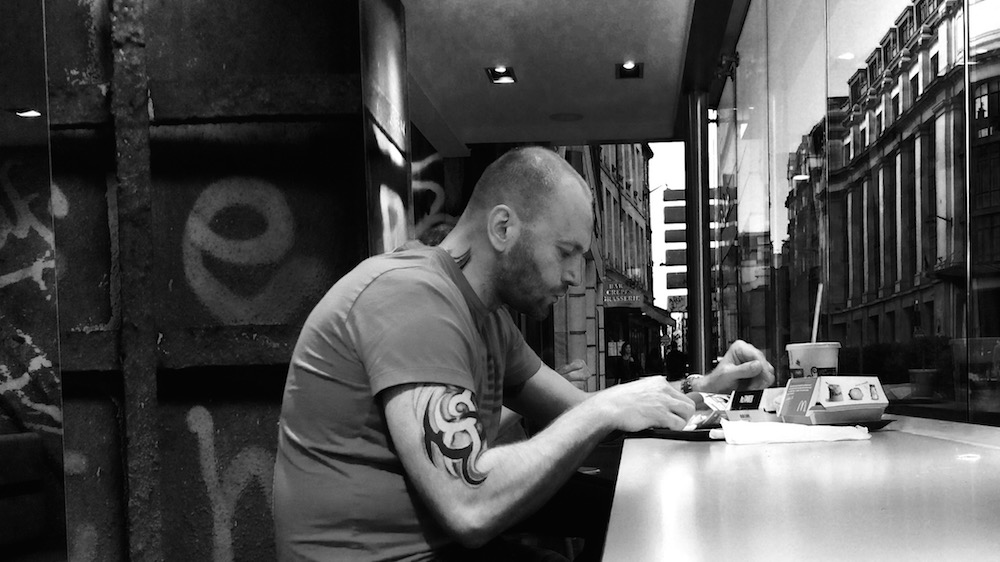

She asked me: “Do you think that Paris is the most beautiful city in the world?”

The correct answer is ‘Yes’ and ‘No,’ and neither are wrong! Que faut-il faire ?

<figure>
    
    <figcaption>Once you’ve seen all the monuments, they recede from the view, but their cultural and historical weight keeps the fabric of the city from being blown away</figcaption>
</figure>

<figure>
    
    <figcaption>You don’t notice the architecture actively, but it remains a part of the landscape as the jaggedness of the rooftops becomes the rhythm section for the visual music captured by your eyes</figcaption>
</figure>

<figure>
    
    <figcaption>The river not so much divides the city as it provides it with a break. Its banks soften the speed by making you slow down as you cross it</figcaption>
</figure>

<figure>
    
    <figcaption>A break for lunch provides a moment of much needed solitude even in the most crowded and noisiest of environments</figcaption>
</figure>

<figure>
    
    <figcaption>Blue-blooded and inclusive, it opens its arms for everyone</figcaption>
</figure>

*Are there more physically beautiful cities?* Yeah, San Francisco, Sydney, Hong Kong, Cape Town come to mind.

*Are there culturally more active cities?* Possibly, New York City.

*Are there more historic cities?* London, many cities in Italy, even Durrës, Albania!

*Are there cities with more extravagant architecture?* Florence.

*Are there cities with better food?* Any city in India.

*Are there cities with more diversity?* Several big cities of the world.

*Are there cities that fill me with more joy?* **Non !**
