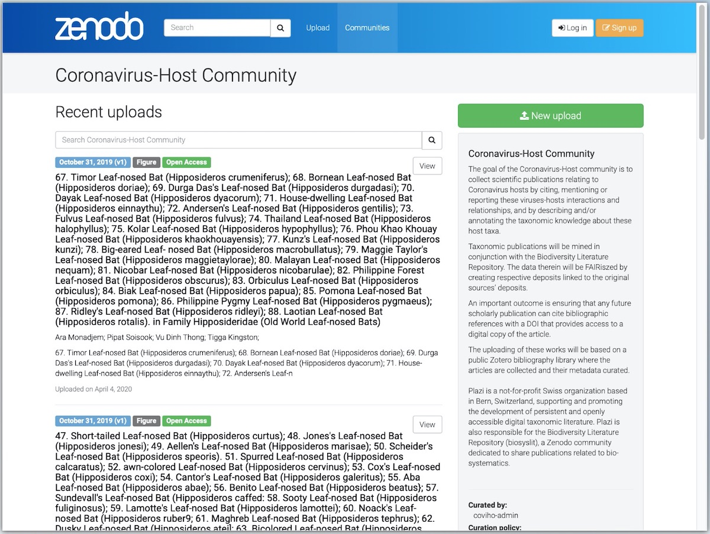
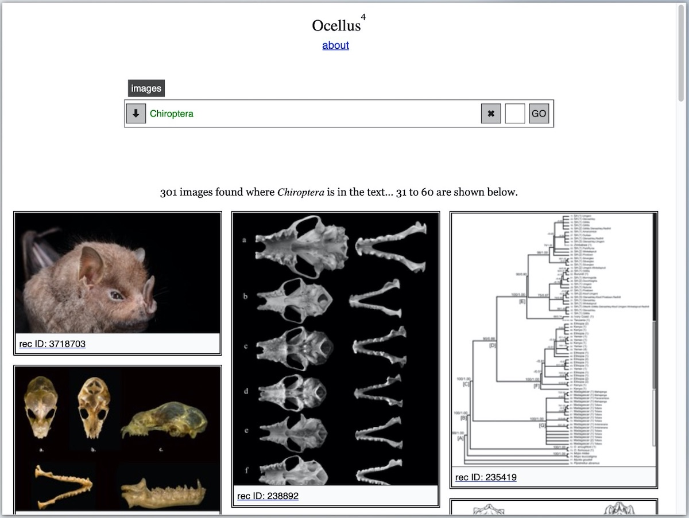

I am a member of [Plazi](http://plazi.org), a small, Switzerland-based international NGO, that devotes its energies to text mining and liberating data from scientific publications. We are a globally distributed team of about half a dozen researchers and data science folks who have implemented a complete pipeline of actions that extract data from PDFs, clean and categorize them, and make them accessible for posterity, under the [CC0 Public Domain Dedication](https://creativecommons.org/publicdomain/zero/1.0/legalcode), on [Zenodo](https://zenodo.org) hosted at CERN.

[In a blog post on Plazi.org](http://plazi.org/news/beitrag/plazi-and-pensoft-launch-an-initiative-to-provide-access-to-scholarly-published-data-about-coronavirus-hosts/a842a012361dd7a7c96b87e21bce8653/), Donat Agosti, the President of Plazi, writes:

> The COVID-19 pandemic presumably started with the escape of the Coronavirus from its bat host to humans. To understand the original host, it is important to have access to relevant scientific knowledge about these organisms. The scientific results from charting the world’s biodiversity reside in a vast corpus, which is often “imprisoned” by paywalls, copyright laws or trapped in formats unfavorable to text and data mining. For the majority of the world’s species, there exist only one or a few articles providing descriptions of the species or adding some additional observations. Even for well-known groups such as birds and mammals, access to primary taxonomic literature requires extensive and time-consuming specialist searches. Bats, suspected hosts of COVID-19 and other viruses such as Ebola, are particularly poorly covered in Catalogue of Life and ITIS, and most taxonomic information is locked within commercial closed-access books and scholarly articles.

This is a classic case of the need for a rapid response that may be hampered by cumbersome licensing restrictions that impede the flow of knowledge from those who have it to those who need it. Plazi and its partners, [Pensoft](https://pensoft.net/) (a Sofia-based scientific publishing company) and Zenodo have launched a new initiative to assist in alleviating this problem. Donat explains:

> For that reason, and in alignment with the recently announced DiSSCo and CETAF COVID-19 Task Force intended to create an efficient network of taxonomists, collection curators and other experts from around the globe, Plazi together with Pensoft are launching an initiative to make broadly accessible taxonomic and other biological traits data about the hosts or vectors of the SARS-CoV-2 or other coronaviruses. We will locate, acquire publications relating to the virus’ hosts and deposit in a newly formed Coronavirus-Host Community, a repository hosted on the Zenodo platform, which will provide persistent open access to these publications, enhanced with taxonomy specific data derived from the sources though text and data mining processes. Currently accessible data on the Biodiversity Literature Repository is accessible here and will be shared with the Coronavirus-Host community.

The way Plazi’s pipeline is setup, soon as we extract data from a publication, all data elements automatically make their way to Zenodo where they get assigned a DOI for permanent archival and retreival. 

<figure>
    
    <figcaption><a href="https://zenodo.org/communities/coviho/?page=1&size=20" target="_blank" title="Chiroptera on the Coronavirus Host Community on Zenodo">The Coronavirus Host Community on Zenodo</a></figcaption>
</figure>

Since we also extract the images and charts from the articles and store them too on Zenodo, [Ocellus](https://ocellus.punkish.org), a simple image-finding app, can retrieve the images easily and quickly

<figure>
    
    <figcaption><a href="https://ocellus.punkish.org/images.html?q=Chiroptera&size=30&page=2&communities=biosyslit" target="_blank" title="Chiroptera on Ocellus">Chiroptera on Ocellus</a></figcaption>
</figure>

The data also feed automatically into the [Global Biodiversity Information Facility](https://gbif.org) (GBIF) and can be reused through various APIs, both on Zenodo as well as Zenodeo, a specialized-API for all the data we extract. The following data are returned when querying Zenodeo with a URI such as [https://zenodeo.punkish.org/v2/images?q=Chiroptera&page=2&size=30](https://zenodeo.punkish.org/v2/images?q=Chiroptera&page=2&size=30) (which also powers [Ocellus](https://ocellus.punkish.org/images.html?q=Chiroptera&size=30&page=2&communities=biosyslit))


```js
{
  "value": {
    "search-criteria": {
      "communities": "biosyslit",
      "facets": "false",
      "page": "2",
      "q": "Chiroptera",
      "size": "30",
      "stats": "false",
      "type": "all"
    },
    "num-of-records": 301,
    "records": [
      {
        "conceptrecid": "3718702",
        "created": "2020-03-20T05:33:09.089436+00:00",
        "doi": "10.3897/zookeys.918.48786.figure1",
        "files": [
          {
            "bucket": "0f30e447-17b2-4547-b2be-bef11fa6226e",
            "checksum": "md5:4ec7b0062dd8a17a16b31876f0515d14",
            "key": "big_388738.jpg",
            "links": {
              "self": "https://zenodo.org/api/files/0f30e447-17b2-4547-b2be-bef11fa6226e/big_388738.jpg"
            },
            "size": 516223,
            "type": "jpg"
          }
        ],
        "id": 3718703,
        "links": {
          "badge": "https://zenodo.org/badge/doi/10.3897/zookeys.918.48786.figure1.svg",
          "bucket": "https://zenodo.org/api/files/0f30e447-17b2-4547-b2be-bef11fa6226e",
          "doi": "https://doi.org/10.3897/zookeys.918.48786.figure1",
          "html": "https://zenodo.org/record/3718703",
          "latest": "https://zenodo.org/api/records/3718703",
          "latest_html": "https://zenodo.org/record/3718703",
          "self": "https://zenodo.org/api/records/3718703",
          "thumb250": "https://zenodo.org/api/iiif/v2/0f30e447-17b2-4547-b2be-bef11fa6226e:935dbc45-af59-412a-ae00-b98de748c209:big_388738.jpg/full/250,/0/default.jpg",
          "thumbs": {
            "10": "https://zenodo.org/record/3718703/thumb10",
            "50": "https://zenodo.org/record/3718703/thumb50",
            "100": "https://zenodo.org/record/3718703/thumb100",
            "250": "https://zenodo.org/record/3718703/thumb250",
            "750": "https://zenodo.org/record/3718703/thumb750",
            "1200": "https://zenodo.org/record/3718703/thumb1200"
          }
        },
        "metadata": {
          "access_right": "open",
          "access_right_category": "success",
          "communities": [
            {
              "id": "biosyslit"
            },
            {
              "id": "coviho"
            }
          ],
          "creators": [
            {
              "affiliation": "Royal Ontario Museum, Toronto, Canada",
              "name": "Lim, Burton K."
            },
            {
              "affiliation": "University of Toronto, Toronto, Canada",
              "name": "Loureiro, Livia O."
            },
            {
              "affiliation": "Universidade Federal de Minas Gerais, Belo Horizonte, Brazil",
              "name": "Garbino, Guilherme S.T."
            }
          ],
          "description": "Figure 1 First record of the big-eyed bat Chiroderma improvisum from Nevis (ROM 126002).",
          "doi": "10.3897/zookeys.918.48786.figure1",
          "keywords": [
            "Animalia",
            "Chordata",
            "Mammalia",
            "Chiroptera",
            "Noctilionoidea",
            "Phyllostomidae",
            "Chiroderma",
            "Chiroderma improvisum",
            "Chiroderma gorgasi Chiroderma improvisum cryptic species cytochrome c oxidase subunit 1 Lesser Antilles"
          ],
          "license": {
            "id": "CC-BY-4.0"
          },

// snipped for brevity
```

As Donat puts it, the current COVID-19 pandemic is just one of the many occasions in which rapid access to all possible data is crucial. For now, we have to act fast. Contributions can be made at various levels, from sending suggestions of articles to be added to the Zotero bibliographies public libraries on virus-hosts associations and on hosts’ taxonomy (such as bats, pangolins or snakes and others), to help converting and FAIRize these articles. Please contact us at [covihost@plazi.org](mailto:covihost@plazi.org) if you want to help.