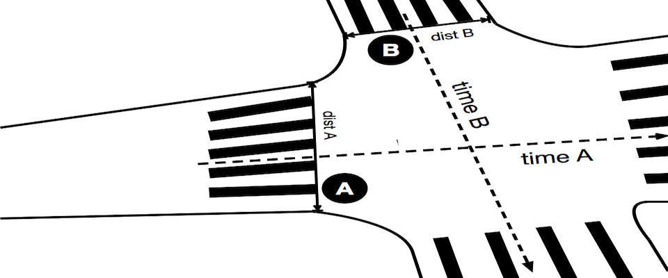

<figure>
    
    <figcaption>dumb city</figcaption>
</figure>

Because the road A is wider and gets more traffic than road B, `time A > time B` and `dist A > dist B` so a person wanting to cross the road at the greater `dist A` gets less `time B` to do so while the person wanting to cross the road at the smaller `dist B` gets more `time A` to do so. What were they thinking?

Turns out, people are doing something about this stupid design in a few places. Per [a report in The Guardian](https://www.theguardian.com/cities/2017/jul/12/dutch-app-elderly-hack-pedestrian-crossings), the city of Tilburg in The Netherlands has deployed a sensor-based solution that, upon sensing an elderly person in the zebra-crossing, delays the *walk* signal from turning back to *stop* while also delaying the corresponding traffic lights from changing. Typically this happens when the one crossing the road is an elderly person and is walking slowly. Any person requiring this facility has to install an app on their smartphone that communicates with the sensors installed at the traffic lights.

> “If I stick to the rules I can only get to the island halfway across before it turns red, so I have to press the button and wait again,” 71-year-old Noud Rommen says. “But nobody wants to do that, so you try to cut between the traffic. It’s not good, but that’s what happens.”

The pilot project is part of a 25-year plan to make Tilburg’s road network more pedestrian and cycle-friendly. I see this as a slender ray of sunshine amidst the dark clouds of “smartcity” hotair that might truly start thinking about [the city itself as an app](City-as-an-App) that enables and promotes healthy and considerate living.
