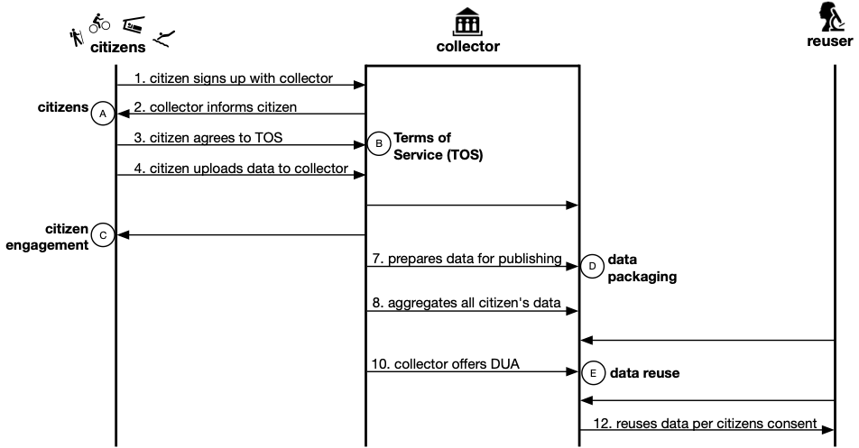

<main>
  <ul class="timeline">
    <li class="others one-four">
        
1859

        
Extinction of old forms is the almost inevitable consequence of the production of new forms

        
Charles Darwin, Origin of Species

    </li>
    <li class="others one-three">
        
1887

        
If a temple is to be erected a temple must be destroyed: that is the law

        
Friedrich Nietzsche, On the Genealogy of Morality

    </li>
    <li class="others one-four">
        
1913

        
Again, however, from destruction a new spirit of creation arises

        
Werner Sombart, Krieg und Kapitalismus

    </li>
    <li class="others two-seven">
        
1942

        
[… Capitalism requires] the perennial gale of Creative Destruction

        
Joseph A. Schumpeter, Socialism and Democracy

    </li>
    <li class="others one-one">
        
1997

        
Disruptive technologies typically enable new markets to emerge

        
Clayton M. Christensen, The Innovator's Dilemma: When New Technologies Cause Great Firms to Fail

    </li>
    <li class="now zero">
        
2019

        
The Disruptive Technologies for Development Challenge… addresses the need… to adopt disruptive technologies to enhance the impact of operations and policy advice in member countries

        
The World Bank

    </li>
    <li class="none"></li>
  </ul>
</main>

## Background

For as long as there has been technology and business, the old order has been replaced by the new. Arguably, this is intrinsic to life itself as any ecologist will point to fire as the agent of change that burns down the old growth so new life can emerge. It is not that the World Bank Group has suddenly become woke to this phenomenon but instead, it realizes the need to better understand the implications of disruptive technologies that could change development paradigms in fundamental ways. The Sustainable Development Practice Group has requested the Transport and Digital Development Global Practice to better understand disruptive technologies and their implications, both positive and negative, on sustainable development. This includes an improved understanding of the scale and implications of these disruptive changes, as well as how to help clients get better access to these technologies and institutional arrangements that can help them meet their evolving development challenges, as well as to help clients better buffer themselves against the implications of these changes. The technologies and trends addressed in this report include:

- [Artificial Intelligence](Disruptive-Technologies/Artificial-Intelligence)
- [Sensors](Disruptive-Technologies/Sensors)
- [3D Printing](Disruptive-Technologies/3D-Printing)
- [Blockchain](Disruptive-Technologies/Blockchain)
- [Open Science and Open Data](Disruptive-Technologies/Open-Science-Open-Data)

Each section, including this introduction, has five parts: Introduction; Disruptive Power; Potential for Development; Caveats; and Resources.

## Disruptive Power

All of the technologies mentioned above have the power to disrupt existing systems. Some of them such as artificial intelligence (AI) and the forerunners of open science and open data have been around for a while but have recently gained steam with easy and cheap availability of network bandwidth and computing power. Others are more recent but have rapidly developed to the point of already being implemented in production systems underpinning medium to large scale investments and activities. 

AI is disintermediating human analysis as a first run on large scale data inputs so experts can devote their precious time to more demanding problems. Sensors are being used for monitoring in remote and uninhabitable but important environments as well as in densely populated areas to provide realtime data on ambient conditions. 3D printing is being utilized to circumvent slow and cumbersome prototyping with immediate development and feedback as well for creation of valuable and scarce materials such as human skin and tissues needed for burn and trauma victims. Blockchain is being used in financial systems where smart contracts are automating cumbersome legal transactions between contracting parties. And open science and data are upending traditional publishing and publicizing processes.

To be disruptive, technologies need not be radical or novel from an engineering or technical point of view. Many become disruptive merely because they cross a tipping point in price or performance or dramatically increase accessibility and/or capabilities relative to the incumbent technologies. Sometimes, ubiquity also characterizes a disruptive technology.

## Potential for Development

From using AI technologies for early detection of disease outbreaks to sensors for environmental quality monitoring to using 3D printers for both rapidly industrial prototyping as well as for human tissue generation for trauma victims and those needing assistance to implementing blockchain-based civic service delivery to energizing the scientific and entrepreneurial landscape with easily accessible data, software and literature – the applications of disruptive technologies to the various processes of government, civic society, businesses, and creative and personal lives are limited only by imagination, implementation and resources.

## Caveats

The one thing all these technologies have in common is that they depend on computers, and as such, are susceptible to all the dangers that are applicable to information technologies in general. The information these technologies generate or use can be hacked by malicious parties, manipulated, and leveraged or utilized for wrong purposes. We see evidence of this in the constant reports of customer databases at businesses being breached, ransomware demands, blockchain hacks, use of 3D printers for making restricted items such as guns, intrusive sensors and the spread of fake news. There is a tension between the need to restrict or eliminate such incidents on the one hand and the freedom to innovate and create technology that can do a lot of good things but also enable such undesirable outcomes. The only feasible ways to balance this tension in free societies is via policy instruments and education. A few of the areas requiring specific attention are described below.

### Information Lifecycle

Information is the raw material for more information. And in that continuous cycle are the two main participants, the data collector and the one on whom the data are being collected.

<figure>
    
    <figcaption>The citizen who is the source of data and the collector of that data, interface at the five points, namely, Ⓐ, Ⓑ, Ⓒ, Ⓓ and Ⓔ as shown in the information lifecycle diagram above. Original illustration by Puneet Kishor released under the CC0 Public Domain Dedication.</figcaption>
</figure>

To make an information lifecycle that is responsive to the fast changing landscape of disruptive technologies, it has to serve the users while protecting those who are the subjects. The five interfaces that need particular attention are described below.

- **A**: Explore the potential of changing the conversation from the imperative of protecting privacy to the benefits of sharing.
- **B**: Demystify the terms of data collection, sharing, access, and reuse by simplifying terms of services (TOS), privacy and sharing policies.
- **C**: Engage citizens by involving them in the management and interpretation of the data sourced from them.
- **D**: Change the way data are collected and packaged for redistribution and sharing.
- **E**: Demystify the Data Use Agreements (DUA).

### Citizens Consent

An omnipresent problem is that citizens give up their personal information without fully understanding what will be collected, where it will go, and how it will be used. It is hard to understand policies around privacy, sharing and access because they are complicated, non-standard, and sometimes even intentionally obfuscating. Citizens Consent can be thought of as analogous to informed consent. Consent is not good unless the user understands the facts, implications, and consequences of giving it. A well-understood and given consent is the right of the citizen and the responsibility of the data collector. There have been many prior attempts at standardizing privacy policies but few have gained traction. A working solution would have to be simple, attractive, and visually display the collecting organization’s data use and sharing policy. It would be targeted at the average user, and focused on data sharing, be informative instead of over-whelming, and be backed by a legally-binding policy.

### Artificial Intelligence

Ironically, perhaps the best tool to fight AI-powered mal-intentioned activities is AI itself. AI sits at the top of the tech food-chain as combating tech malfeasance at scale is only possible via programmatic responses overseen by expert human curation.

### Policy and Regulation

Traditionally law has trailed the rapid changes in technology and technology-driven cultural changes. In the United States, HIPAA and Common Rule, designed to protect human subjects can also become a deterrent to innovation by restricting the flow of information to legitimate users of it. In Europe, the General Data Protection Regulation (GDPR) proposes a layered set of standards to protect individual privacy. All these regulations have to balance the requirement for security and privacy with the legitimate need for sharing. Similarly, policy and regulation also have to permit healthy innovation in fields such as stem cells, CRISPR genetic manipulation, and use of 3D printers for human tissue while also dissuading dangerous or ethically questionable experiments.

## Resources

    
National Research Council. 2010. <a href="https://www.nap.edu/read/12557/chapter/1" target="_blank">Persistent Forecasting of Disruptive Technologies.</a> Washington, DC: The National Academies Press. doi: 10.17226/12557.

    
Technological innovations are key causal agents of surprise and disruption. These innovations, and the disruption they produce, have the potential to affect people and societies and therefore government policy, especially policy related to national security. Because the innovations can come from many sectors, they are difficult to predict and prepare for. The purpose of predicting technology is to minimize or eliminate this surprise. To aid in the development of forecasting methodologies and strategies, the Committee on Forecasting Future Disruptive Technologies of the National Research Council (NRC) was funded by the Director, Defense Research and Engineering (DDR&E) and the Defense Intelligence Agency’s (DIA’s) Defense Warning Office (DWO) to provide an analysis of disruptive technologies.

    
Daniel Leipziger and Victoria Dodev. 2016. <a href="https://www2.gwu.edu/~iiep/assets/docs/papers/2016WP/LeipzigerDodevIIEPWP2016-13.pdf" target="_blank">Disruptive Technologies and their Implications for Economic Policy: Some Preliminary Observations.</a> Institute for International Economic Policy, George Washington University, Washington DC.

    
It is generally accepted that technological innovation has been at the core of firm level productivity gains and the economic growth of countries. This general proposition as described by Solow (1956) and enhanced by Romer (1990), Aghion and Howitt (1992), and others embeds in it the notion that more productive firms will displace less productive ones in a Schumpeterian fashion. … Disruptive technologies have the potential to impact growth, employment, and inequality by creating new markets and business practices, needs for new product infrastructure, and different labor skills. This, in addition to affecting existing firms in established markets, can also affect the labor market, incomes of workers, and ultimately the distribution of income.

    
KPMG. <a href="https://assets.kpmg/content/dam/kpmg/it/pdf/2017/03/KPMG_Disruptive-tech-2017-part1.pdf" target="_blank">The changing landscape of disruptive technologies: Global technology innovation hubs.</a>

    
This report showcases the rise of new ecosystems of incubators, accelerators, and venture capital alongside government incentives across the world. In this section, we unfold the cities and countries that are making significant strides in innovation development and provide 15 country perspectives. With stakes so high to compete in a global technology industry ecosystem, we also examine the global leadership views on innovation management.

