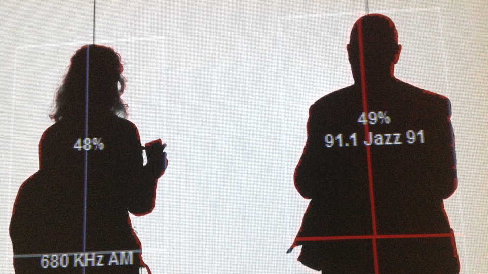

<figure>
    
    <figcaption>Frequency and Volume</figcaption>
</figure>

[Yvette Thijm](https://witness.org/portfolio_page/yvette-alberdingk-thijm/) and I spent a lovely afternoon at SFMOMA, and I took the photo above at [Rafael Lozano-Hemmer](http://www.lozano-hemmer.com)'s interactive exhibit titled [Frequency and Volume](http://www.sfmoma.org/exhib_events/exhibitions/459). Basically, Rafael has a big antenna installed at the museum that picks up all manner of radio waves. A shape detection algorithm identifies the silhouette outline of viewers and chooses a frequency from all those streaming in, and plays it on the radio. A nice coincident that I caused the jazz station to kick in.

Yvette tells me the project has a social origin: 

> The project was developed at a time when the Mexican Government was very active in shutting down informal or “pirate” radio stations in indigenous communities in the states of Chiapas and Guerrero. The question, “who has access to the public space that is the radioelectric spectrum” is one that deserves attention and visualization tools not just in Mexico but also here in the developed world, where there is a remarkable assymmetry in the assignation of frequencies only to government or corporate interests to the detriment of community-building, experimental or artistic uses of the spectrum. This project was inspired by the “Manifesto for Antenna-Man” and the radio poetry experiments by the Mexican estridentista artists in the 1920s.

In Yvette’s words, “Maybe Rafael is onto something… building a (creative) commons of radio frequencies?”
