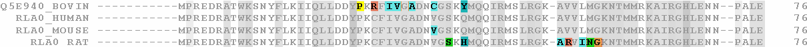

    These content below constitutes a part of the work I did while working as the Manager of Science and Data Policy at Creative Commons. This content is an archive of what used to be on <u>http://science.creativecommons.org/</u> but is no longer available on the web. I have preserved the original content and added more material to them.

<figure>
    
    <figcaption>"Sharing v. Privacy" by Puneet Kishor released under a <a href="http://creativecommons.org/publicdomain/zero/1.0/" target="_blank">CC0 Public Domain Dedication</a>. Original "RPLP0 90 ClustalW aln" by  uploader Miguel Andrade at en.wikipedia licensed under <a href="http://creativecommons.org/licenses/by-sa/3.0/">CC BY-SA 3.0 license</a> via <a href="http://commons.wikimedia.org/wiki/File:RPLP0_90_ClustalW_aln.gif#mediaviewer/File:RPLP0_90_ClustalW_aln.gif">Wikimedia Commons</a>.</figcaption>
</figure>

back to <a href="">Sharing v Privacy</a>

    

    
Compiled from originals at <a href="http://engageuc.org" target="_blank">EngageUC</a>, <a href="http://rochesterproject.org" target="_blank">Rochester Epidemilogy Project</a>, and <a href="http://www.ncbi.nlm.nih.gov/gap" target="_blank">dbGaP</a>.

<dl id="deflist"></dl>
