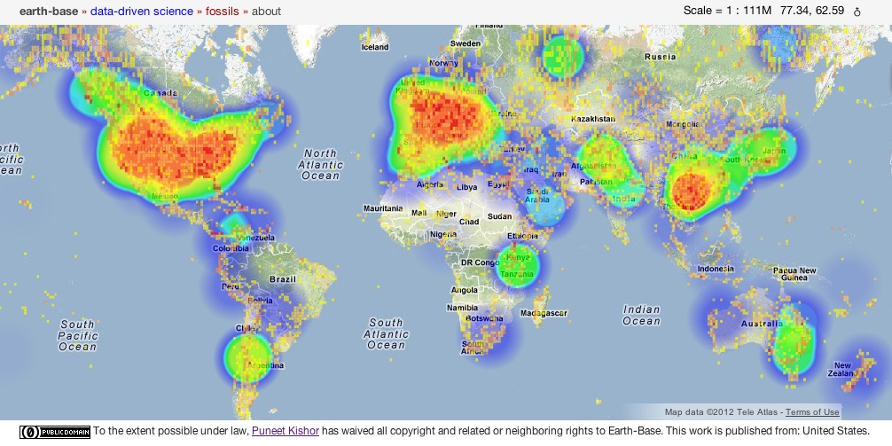

<figure>
    
    <figcaption>heatmap</figcaption>
</figure>

----

The map above shows a heatmap of fossil clusters overlaid on top of fossil occurrence density per 1 degree square grid cell. The clusters are calculated using a function written in PL/R, and the heatmap is drawn with the JSON data.

<pre><code class="SQL">--  This function calculates requested number of clusters for a 
--  set of lnt/lat points using R's built-in 'kmeans' method.

--  Mar 24, 2012
--  Puneet Kishor punkish@eidesis.org
--  All my contribution is released under a CC0 License Waiver
--  Effectively in the Public Domain

--  Requirements: 
--      R-2.14.0
--      PostgreSQL-9.0.x with PostGIS-1.5.x and PL/R-8.2.0.4 installed

--      SELECT r_clusters(
--   		$num_of_clusters, 
--			array_agg(ST_X(the_geom)), 
--			array_agg(ST_Y(the_geom))
--		) 
--		FROM table  

--  Where:
--  'table' is the table or query containing the points to be used 
--      for calculating the clusters

--  Output: returns a recordset of the clusters, which contains  
--      the center of the cluster

-- Function: r_clusters(integer, double precision[], double precision[])

-- DROP FUNCTION r_clusters(integer, double precision[], double precision[]);

CREATE OR REPLACE FUNCTION r_clusters(
	num_of_clusters integer, 
	lon double precision[], 
	lat double precision[]
)
RETURNS numeric[] AS
$BODY$
</code></pre>

R code below

<pre><code class="R"># Puneet Kishor, Dec 20, 2011.
# Adapted for PL/R

# Takes a number of clusters, and two arrays, one for lon and the other for lat.
# Returns an array of lon, lat, and count for each cluster.
data <- cbind(lon, lat)

cl <- kmeans(data, num_of_clusters)

lon = as.numeric(cl$centers[,1])
lat = as.numeric(cl$centers[,2])
size = cl$size

result <- t(data.frame(lon = lon, lat = lat, size = size))
return(result)
</code></pre>
Close off with SQL
<pre><code class="SQL">$BODY$
LANGUAGE 'plr';
</code></pre>
