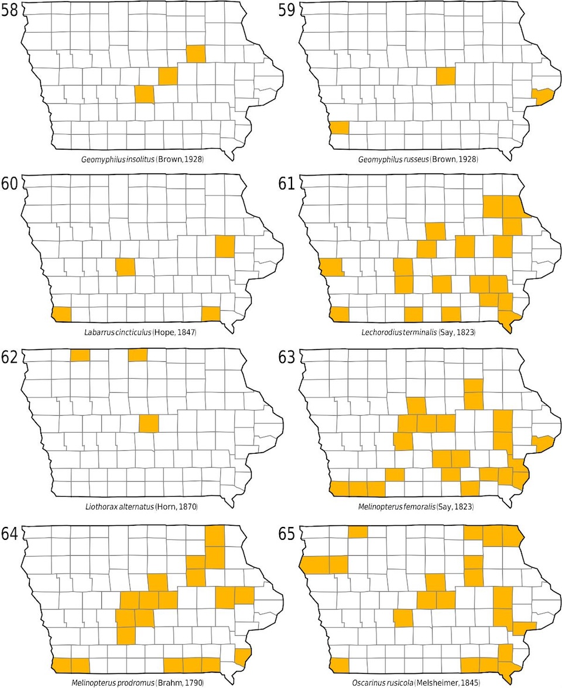

[write a story in igbo](http://askzai.net/?heyzai=write%20a%20story%20in%20igbo)

**Igbo Story: "Liothorax" – The Journey of a Botanical Discovery** Liothorax alternatus, once a humble specimen from Ames, Iowa, in April 1926, 1930, and 1931, became the subject of a botanist’s meticulous journey. This insect, with its intricate life cycle and diverse habitats, captured the attention of researchers across the Midwest. In 1926, a young botanist from Iowa, O. L. Cartwright, meticulously documented the specimen at the Ames, Iowa, facility. The date marked April 16, 1926, as the specimen was collected under the guidance of the county. The specimen, labeled by O. L. Cartwright in 1955, became a cornerstone of the study, reflecting the botanist’s dedication to preservation. By 1930, the same specimen, now housed in a different location, was examined by H. E. Guthrie. This second collection, dated April 3, 1930, and later noted in 1931, highlighted the specimen’s significance as a living testament to the region’s biodiversity. The third collection, from April 29, 1931, by W. E. Heston, added a layer of historical context to the story, showing the specimen’s enduring legacy. The county records in Dickinson, Story, and Winnebago suggest the specimens were part of broader ecological research projects. Melinopterus Mulsant, noted in 1842, adds a historical thread, indicating the species was previously studied and cataloged. As the years passed, Liothorax alternatus became a symbol of the interplay between preservation and discovery. Its journey from Iowa to the Midwest exemplifies how botanists, like Cartwright and Guthrie, continue to document and protect the natural world. In the quiet corners of the Midwest, Liothorax alternatus remains a beacon of scientific curiosity, a story of dedication, and a reminder of the power of human observation in the natural world. Here is a related image

<figure>
    
    <figcaption>Igbo</figcaption>
</figure>

Answer generated based on the following treatment:

<cite>Liothorax alternatus from: Freese, Edwin L., Veal, Doug A. & Lago, Paul K. (2020-08-28). The Scarabaeoidea (Coleoptera) of Iowa: An annotated checklist. Insecta Mundi 2020, DOI: 10.5281/zenodo.5353792</cite>