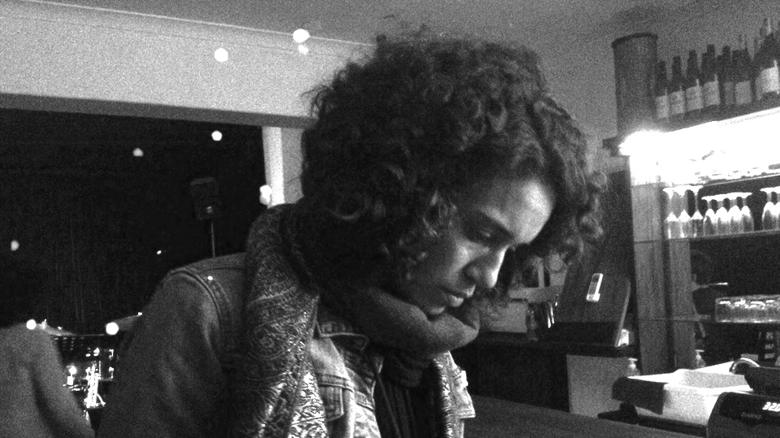

<figure>
    
    <figcaption>Antoinette</figcaption>
</figure>

Black absorbs every hue,  
from red to brown and in between.  
On this agree we all do  
It’s a lovely blue in green

Colors longing to be free  
Cling entwined in the second set,  
With a glass of Silvertree[^1]  
And a girl called Antoinette  

[^1]: A South African beer
