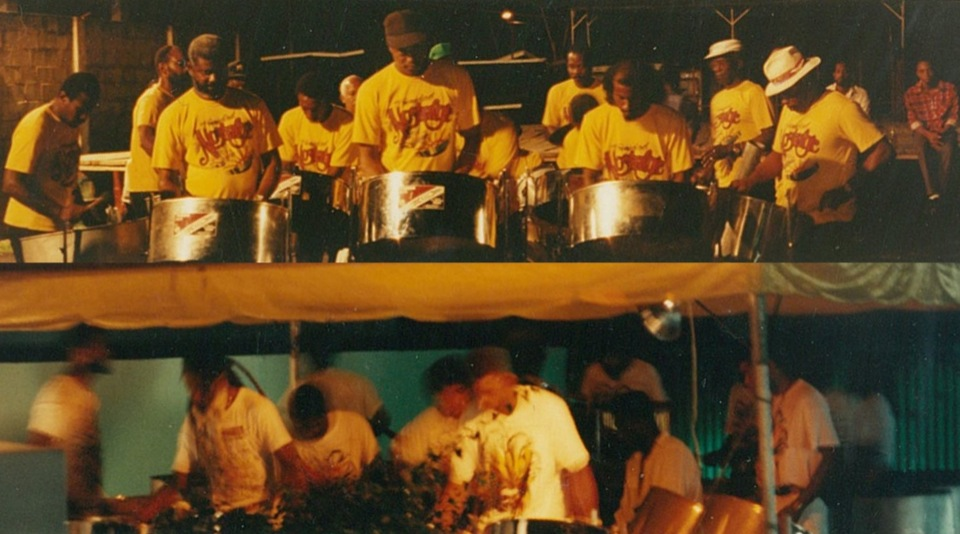
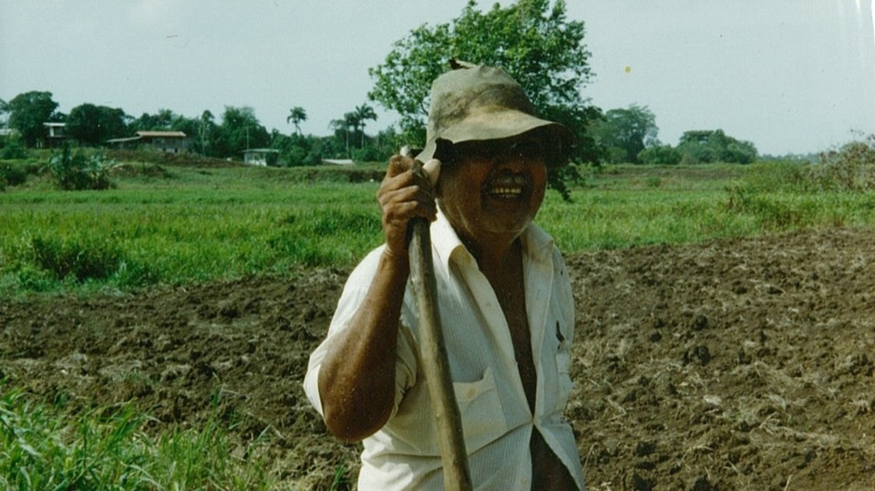
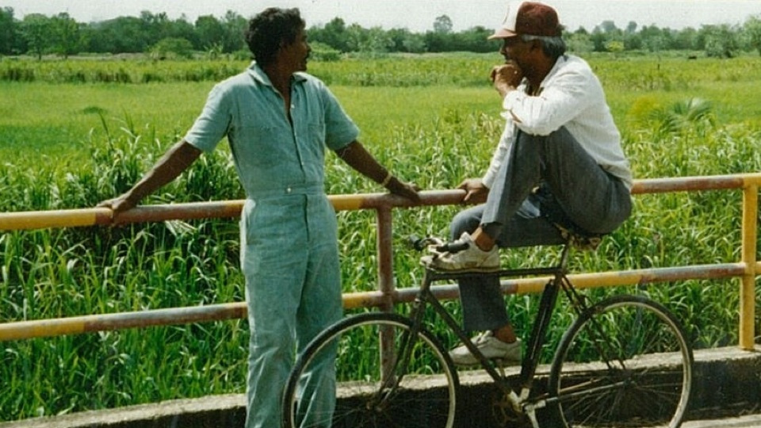

In 1991 Fall I spent three glorious months living in St. Augustine and working in Port of Spain. The few photos below don’t do justice to my experience. <!-- from the [Caribbean Nights]() to the [Sunlight of My Mind](). -->

<figure>
    
    <figcaption>The steel drum band Renegades in their pan yard</figcaption>
</figure>

<figure>
    
    <figcaption>Another steel drum band, another pan yard, a night of dancing</figcaption>
</figure>

<figure>
    
    <figcaption>Pan drums just waiting to be played</figcaption>
</figure>

<figure>
    
    <figcaption>Steve and I</figcaption>
</figure>

<figure>
    
    <figcaption>Portrait of the author as a young man</figcaption>
</figure>

<figure>
    
    <figcaption>Frederick, the pineapple farmer</figcaption>
</figure>

<figure>
    
    <figcaption>An Indian farmer</figcaption>
</figure>

<figure>
    
    <figcaption>Faces of Trinidad</figcaption>
</figure>

<figure>
    
    <figcaption>More faces of Trinidad</figcaption>
</figure>

<figure>
    
    <figcaption>Limin’ by the roadside</figcaption>
</figure>
