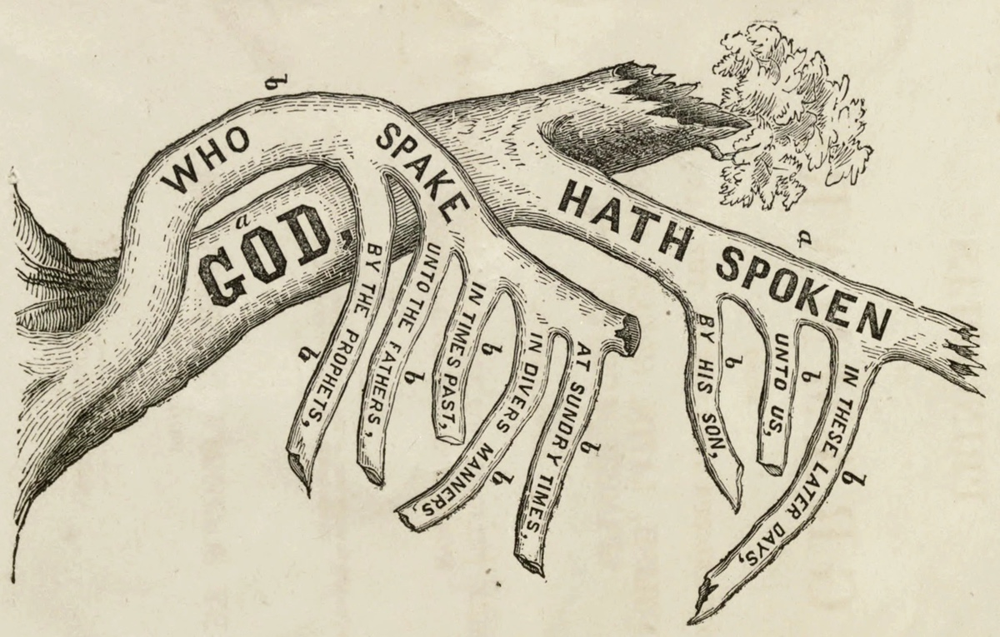

<cite>“Once you really know how to diagram a sentence really know it, you know practically all you have to know about English grammar”, Gertrude Stein once claimed. While one student’s lexical excitement is surely another’s slow death by gerund, Stein cuts to the heart of the grammatical pull. — James Brown, The American Grammar (Philadelphia, PA: Clark and Raser, 1831).</cite>

**Note:** This is a response to [the naYana proposal](https://www.gnowledge.org/nayana/manifesto.html) by my friends at the Gnowledge lab. The title of my response is just to poke some good-hearted fun, not to be taken seriously. As much as I disagree with their thesis, I want to see more progress on this by them (not by me) because re-inventing the wheel is often the point—even if, in this case, the re-invented wheel is pointed rather than round.

## The Depth That Built the World: A Response to naYana

First, here is what I agree with: English is not just orthographically deep, it is opaque. Making sense of English is like trying to recognize one’s reflection in a dirty stained-glass window.

That is it. That is the extent of my agreement.

## The “Lost Time” Fallacy

The naYana proposal is clever and seems humane, yet it rests on a foundational error: treating the time spent acquiring literacy as “stolen” hours. This assumes orthographic difficulty and intellectual vitality are inversely related. History suggests the opposite. The “tax” that the proposal laments is actually a front-loaded investment. While a Finnish child decodes faster at age seven, the English reader spends adulthood reaping the morphophonemic dividend.

Most of the thesis rests on the apparent hours lost by young English learners (such as myself, 50 years ago) as opposed to, say, the Finns or the Españoles. My counter to that are the countless hours saved later in life when interfacing with the English speaking world through my education and work. *Imajin me riting a letur to mi employer and getting laffed aaoot of the rum.*

By preserving the *sign* in *signature* or the *photo* in *photograph*, English prioritizes the mind over the ear. It allows us to leap directly to the semantic root. A phonetic script would shatter these “meaning families,” forcing readers to reconstruct relationships that our “messy” spelling provides for free. naYana is not returning time; it is charging admission to a richer language that the child must pay back later, with compounded interest.

## The Success of the “Broken” System

If orthographic depth were a ceiling, English would be trapped in the basement. Instead, it is the global language of science, computing, aviation, and law. Shakespeare, Darwin, and Toni Morrison weren’t stunted by the spelling of *knight* or *though*. The irregularities that naYana proposes to “correct” are the very texture of the language—its layering of Anglo-Saxon, Norman French, and Latin. Normalizing the spelling doesn’t just clean the surface; it severs the depth.

## The Phonetic Civil War

Phonetic reform is an attempt to photograph language mid-breath. But human mouths never stop moving. In fifty years, a “perfect” 2026 phonetic script will be just as irregular as today’s, but without the etymological anchors.

Furthermore, whose phonemes get the keys to the kingdom? As Indian philosophers of science would acknowledge, Indian English is its own glorious beast. If we go phonetic, do we use the Mumbai lilt or the Delhi drawl? Do we mark the retroflex ‘t’ and ‘d’ that give Indian English its rhythm? By chasing “purity,” you’re accidentally starting a civil war. Our current spelling is the only peace treaty that allows a rhotic American, a non-rhotic Londoner, and a syllable-timed Mumbaikar to agree on the word *car* without arguing over the ‘r’.

## Conclusion

The question is not how fast a child can decode, but what kind of reader she becomes. English hasn’t been stunted by its spelling; it has been deepened and made vast by it. English became the world’s working language while spelling Actinopterygii as *fish*, not as *ghoti*. With a hat-tip to Mr. Shaw, ‘gh’ can never sound like ‘f’ at the start of a word.

## A Few Petty Observations

Spanish is “better” only if one equates “shallow” with “good.” But even its rules have friction. For example:

- c followed by e|i is soft, but not like s. In mainland Spain it is more like a lisped s “th”. But, c followed by a|o|u is hard like k.
- g followed by e|i sounds like gh with a more aspirated h. And j too has an aspirated sound as in pájaro (bird). They are both a voiceless velar fricative (the /x/ sound). 
- But, g followed by a|o is hard like g in “god”. And, g followed by u followed by e|i takes on the sound of the second vowel (guia is pronounced gee-a where the g sounds like g in “god”) but g followed by u followed by any other vowel a|o behaves like a normal g (see above). The u functions orthographically to preserve the hard /g/ before e or i.

Confused much? If one remembers the rules, a language is shallow. If not, it is deeper. English too has rules; it just happens to have a separate rule for every single case. It’s a 1:1 map of the world that covers the entire world.

Regarding the IPA: Using a linguist’s tools for a child’s script is like giving a toddler a scalpel to cut construction paper. Keep the schwas in the lab; let the kids keep their “messy” but meaningful alphabet.

The “Manifesto” Irony: If your URL is `manifesto.html`, please don’t say, “This is not a manifesto.”

The Palindrome Problem: I admire the ambition, though I must gently object that naYana is not, strictly speaking, a palindrome unless pronounced by a very obedient robot. In the Roman alphabet, *A != N*. In reality, the first ‘a’ is a full vowel and the last is a dying schwa. You realize that if you swallow a sound to save a slogan, the sounds you swallow always come back to haunt the syntax.