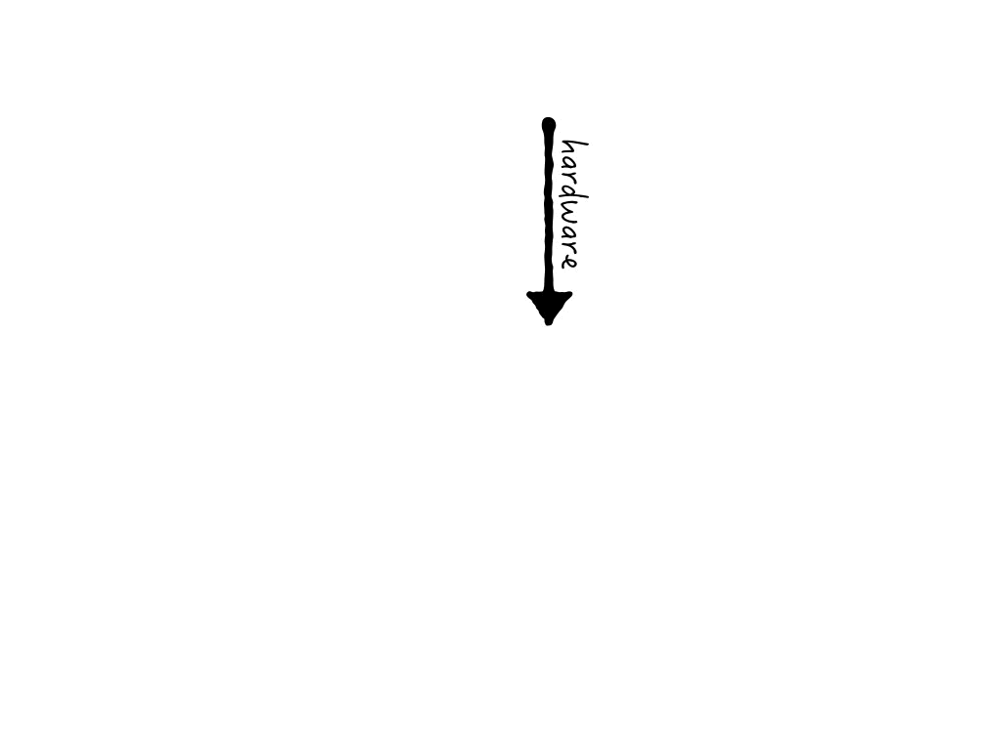

## Open But Unequal

&nbsp;

<h3>science outside institutions</h3>

&nbsp;

&nbsp;

&nbsp;

by Puneet Kishor

Released under a [CC0 Public Domain Dedication](http://creativecommons.org/publicdomain/zero/1.0/).

**Help:** Notes are hidden, but may be seen or hidden by pressing 'p'. Swipe on touch devices or use ← and → keys on your keyboard to change slides.

???

This is not a scientific talk. It is a talk based on anecdotes and personal experience. I am an environmental scientist with a fair amount of experience in natural resources and earth science data analysis and management. I spent the last eight years of my life, the last three full time, advocating for open science, and as a consequence, immersed in copyright-related issues. For the past six months I have been independent, and a lot of my thoughts have focused based on this experience.

---

## Science is Primarily Institutional

When we are a part of an institution, we forget what it is like to be outside it.

Call it **Institutional Hegemony**.

???

I signed up for a workshop and wrote “independent” in the affiliation field, and was told that unless I provided a valid affiliation, I would be denied admission. Thankfully I was able to pull out my experience and background (with an organization) and the organizers backed off. But not everyone may be able to do that.

---

## Science in Formal Academies

.left-column[
  ### Scientists
]
.right-column[
Employees at 
* universities
* research agencies
* private firms  
]

---

## Science in Formal Academies

.left-column[
  ### Scientists
  ### Content
]
.right-column[
* lectures
* books
]

---

## Science in Formal Academies

.left-column[
  ### Scientists
  ### Content
  ### Infrastructure
]
.right-column[
* labs
* instruments
* commercial and open source software
]

---

## Science in Formal Academies

.left-column[
  ### Scientists
  ### Content
  ### Infrastructure
  ### Reputation
]
.right-column[
* exams
* degrees
* papers (citation impact factor)
]

---

## Science in Formal Academies

.left-column[
  ### Scientists
  ### Content
  ### Infrastructure
  ### Reputation
  ### Community
]
.right-column[
* conferences and workshops
* usually very expensive, and requiring an affiliation with an institution
]

---

## Science in Formal Academies

.left-column[
  ### Scientists
  ### Content
  ### Infrastructure
  ### Reputation
  ### Community
  ### Intellectual Property Framework
]
.right-column[
* copyright
* patents
* MTAs
* norms
]

---

## Science in Informal Academies

.left-column[
  ### Scientists
]
.right-column[
individuals like you and me 
]

---

## Science in Informal Academies

.left-column[
  ### Scientists
]
.right-column[
individuals like you and me  
*well, at least me*  
]

---

## Science in Informal Academies

.left-column[
  ### Scientists
  ### Content
]
.right-column[
* MOOCs
* DIY videos
* tutorials
]

---

## Science in Informal Academies

.left-column[
  ### Scientists
  ### Content
  ### Infrastructure
]
.right-column[
* hacker- and maker-spaces  
* open hardware and sensors  
* commercial and open source software
]

---

## Science in Informal Academies

.left-column[
  ### Scientists
  ### Content
  ### Infrastructure
]
.right-column[
* hacker- and maker-spaces  
* open hardware and sensors  
* <strike>commercial and</strike> open source software
]

---

## Science in Informal Academies

.left-column[
  ### Scientists
  ### Content
  ### Infrastructure
  ### Reputation
]
.right-column[
Online reputation
* karma points
* votes
* software commits
]

---

## Science in Informal Academies

.left-column[
  ### Scientists
  ### Content
  ### Infrastructure
  ### Reputation
  ### Community
]
.right-column[
* volunteer-organized (un-)conferences
* online forums
* user-groups
]

---

## Science in Informal Academies

.left-column[
  ### Scientists
  ### Content
  ### Infrastructure
  ### Reputation
  ### Community
  ### Intellectual Property Framework
]
.right-column[
* copyright
* patents
* MTAs
* norms
]

---

## Science in Informal Academies

.left-column[
  ### Scientists
  ### Content
  ### Infrastructure
  ### Reputation
  ### Community
  ### Intellectual Property Framework
]
.right-column[
* <strike>copyright</strike>
* <strike>patents</strike>
* <strike>MTAs</strike> 
* norms, and hopefully nothing else
]

---

## The Current Status is Exclusionary

.left-column[
  ### Scientists
]
.right-column[
Institutional scientists and citizen scientists seldom meet and exchange notes
]

---

## The Current Status is Exclusionary

.left-column[
  ### Scientists
  ### Content
]
.right-column[
The content is behind login walls, is IP-protected and expensive
]

---

## The Current Status is Exclusionary

.left-column[
  ### Scientists
  ### Content
  ### Infrastructure
]
.right-column[
Labs and instruments are out-of-reach of those not a member of the institution  

]

???

This sign was posted on the door of a makerspace that is housed in an institution. You have to be a member of the institution to access the space. But the language is harsh whereby a non-member is seen as a "problem."

---

## The Current Status is Exclusionary

.left-column[
  ### Scientists
  ### Content
  ### Infrastructure
  ### Reputation
]
.right-column[
Reputation system is self-selecting and rigged toward perpetuating silos.

The focus on &copy; reinforces the importance of publications over everything else. Science is a lot more than just its published results.
]

???

Science is a cyclical process, of reading the works of others, observing, hypothesizing, experimenting, analyzing and publishing one's own conclusions so the cycle may repeat. By focusing only on copyright, we are focusing only on one aspect of this process while understating the importance of the other. Our finite energies are sucked away trying to solve an artificial problem that is based on perceptions and beliefs rather than facts. And besides, we do little to change a way of working that at least passively and at worst actively excludes those who are not a part of the club.

---

## The Current Status is Exclusionary

.left-column[
  ### Scientists
  ### Content
  ### Infrastructure
  ### Reputation
  ### Community
]
.right-column[
Non-local physical gatherings are expensive.

The difficulties in getting travel visa makes it very difficult for scientists from developing countries to attend conferences held in developed countries 
]

---

## The Current Status is Exclusionary

.left-column[
  ### Scientists
  ### Content
  ### Infrastructure
  ### Reputation
  ### Community
  ### Intellectual Property Framework
]
.right-column[
The legal framework is complicated, onerous and a waste-of-time for scientists

note: *someone should add up all the scientist-hours spent arguing about copyright and open access*
]

---

# So, what can we do?

---

## Open license is a start, not the end

* Add an open license to your work
* Use as liberal a license as possible, preferably CC0/PD
* Make your work available to others
* Make it easy for others to reuse it
* Engage with the community

---

## Engage with the community

* devise projects that engage citizens
* hold science cafés/pubs
* join a makerspace
* become a mentor
* help start a community makerspace
* (figure out how to) donate old equipment

---

## To Do

### channel funding to extra-institutional science

As is, funding is available only to those with an affiliation. Other than Kickstarter-type crowd funding mechanisms, citizen scientists have no way to acquire non-personal funds to support their inquiry.

---

## To Do

### work out the integration of extra-institution and traditional science

Integration of citizen/extra-institutional science with traditional science is an issue because the results of extra-institutional science are not published in a way that aligns with traditional science's record-keeping. No institutional repositories, DOIs, traditional review. 

---

