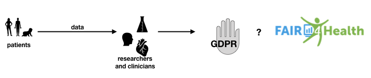

<figure>
    
    <figcaption>Three constituencies at odds</figcaption>
</figure>

## Axioms

- De-identification is ineffective and expensive[^1]
- There is no such thing as foolproof de-identification[^2]
- Unimportant items of information can be combined to create important information;[^3]; [^4]
- Ubiquitous data collection means we have no– to little–control over our data
- All digital databases can and very likely will be breached[^5]
- Remedy for harm from breach is not always calculable or enforceable[^6]
- Consent is imperfect[^7] but is necessary even if it is implicit
- Sharing and privacy are two sides of the same coin[^8]

## Clinicians and Researchers Want

Non-de-identified data. Data from which the identify of the patient has been removed is not as useful as data that identifies the patient. Doctors are not interested in personal identity, but they want to know personal characteristics such as race, age, gender, where the patient was born, where the patient lives, even the income level, etc. These characteristics impact health in important and specific ways but they also identify the patient personally.

Specific, targeted data, not-generic and not-voluminous data. For example, MBs of fitbit data are not useful, but focused blood pressure readings or heart beat data may be useful. One term used is “prescribed data,” that is, the doctor prescribes to the patient to collect and submit specific data.

## GDPR wants

GDPR has specific definitions for personal data,[^9] genetic data,[^10] biometric[^11] and health data.[^12] The Article 6 of GDPR[^13] allows lawful processing of personal data if one or more of the following conditions are met:

- the data subject has given consent;
- it is necessary for the performance of a contract to which the data subject is party;
- it is necessary for compliance with a legal obligation;
- it is necessary to protect the vital interest of the data subject or another natural - person;
- it is necessary for the performance of a task carried out in the public interest;
- it is necessary for the purposes of the legitimate interests pursued by the controller or third party.

However GDPR prohibits processing of biometric, genetic, and health data unless one of the three conditions below would apply:

- The data subject must have given “explicit consent.”
- “Processing is necessary for the purposes of preventive or occupational medicine, for the assessment of the working capacity of the employee, medical diagnosis, the provision of health or social care or treatment or the management of health or social care systems and services”
- “Processing is necessary for reasons of public interest in the area of public health, such as protecting against serious cross-border threats to health or ensuring high standards of quality and safety of health care and of medicinal products or medical devices”

## FAIR4Health wants

Data from publicly funded research to be findable, accessible, interoperable, and reusable. But, does that include clinical research? Clinical research, as opposed to basic research, is based on personally identifiable information, and as such, is required by law to be protected.[^14]

Personal health data from non-medical, commercially available devices such as pedometers, blood pressure monitors, and sleep trackers are usually shared with the device providers via contractual agreements “signed” by the people when they sign up for these services. These data are not from publicly funded research, but can be valuable for medical purposes. My assumption is that FAIR4Health excludes such data.
Since EHRs are not a product of publicly funded research, my assumption is that FAIR4Health excludes such data.

However, publicly funded research data may also contain personally identifiable information. If so, that information has to be removed through a process of specified de-identification. However, it may still have to be restricted to a certain community rather than be made available to everyone. Is the data still FAIR if it is restricted to a specified community?

[^1]: “Anonymization is increasingly easily defeated by the very techniques that are being developed for many legitimate applications of big data. In general, as the size and diversity of available data grows, the likelihood of being able to re‐identify individuals (that is, re‐associate their records with their names) grows substantially. While anonymization may remain somewhat useful as an added safeguard in some situations, approaches that deem it, by itself, a sufficient safeguard need updating.” — <a href="https://obamawhitehouse.archives.gov/sites/default/files/microsites/ostp/PCAST/pcast_big_data_and_privacy_-_may_2014.pdf" target="_blank">PCAST. 2014. Big Data and Privacy: A Technological Perspective.</a>

[^2]: "87% of the U.S. Population are uniquely identified by just three pieces of information — date of birth, gender, ZIP." <a href="http://latanyasweeney.org/work/identifiability.html" target="_blank">Latanya Sweeney on Identifiability</a> 

[^3]: C. Hanson, T. Berners-Lee, L. Kagal, G. J. Sussman and D. Weitzner, <a href="http://dig.csail.mit.edu/2006/Papers/Policy07/data-purpose-algebra.pdf" target="_blank">“Data-Purpose Algebra: Modeling Data Usage Policies</a>,” Eighth IEEE International Workshop on Policies for Distributed Systems and Networks (POLICY'07), Bologna, 2007, pp. 173-177. doi: 10.1109/POLICY.2007.14

[^4]: People’s faces are being used without their permission, in order to power technology that could eventually be used to surveil them, legal experts say. NBC News. 2019. <a href="https://www.nbcnews.com/tech/internet/facial-recognition-s-dirty-little-secret-millions-online-photos-scraped-n981921" target="_blank">Facial recognition’s ‘dirty little secret’: Millions of online photos scraped without consent</a>.

[^5]: Steven Brenner. 2013. <a href="https://drive.google.com/open?id=0B_t-G30CZ3Znamc2ZVBEczhCWUE&authuser=1" target="_blank">Be Prepared for the Big Genome Leak, Nature, Vol 498, p 139</a>

[^6]: For all the concern expressed about companies' exposure to lawsuits in the wake of of data breaches, a decision earlier this week by a federal appeals court shows yet again what a challenge it can be for consumers to actually win redress when one occurs. Jaikumar Vijayan. 2007. <a href="https://www.computerworld.com/article/2540587/are-data-breach-lawsuits-just-tilting-at-windmills-.html" target="_blank">Are data breach lawsuits just tilting at windmills?</a> Computerworld

[^7]: “Only in a fantasy world do users actually read the consent notices and understand their implications. The conceptual problem with notice and consent is that it fundamentally places the burden of privacy protection on the individual. Notice and consent creates a non‐level playing field in the implicit privacy negotiation between provider and user. The provider offers a complex, take‐it‐or‐leave‐it set of terms, while the user, in practice, can allocate only a few seconds to evaluating the offer. This is a kind of market failure.” — <a href="https://obamawhitehouse.archives.gov/sites/default/files/microsites/ostp/PCAST/pcast_big_data_and_privacy_-_may_2014.pdf" target="_blank">PCAST. 2014. Big Data and Privacy: A Technological Perspective.</a>

[^8]: “(Sharing and privacy are) mutually implicated in each other: there are private interests in the achievement of common goals and a public interest in the protection of privacy that encourages cooperation.” — The Nuffield Council on Bioethics. 2015. <a href="http://nuffieldbioethics.org/wp-content/uploads/Biological_and_health_data_web.pdf" target="_blank">The collection, linking and use of data in biomedical research and health care: ethical issues.</a>

[^9]: ‘personal data’ means any information relating to an identified or identifiable natural person (‘data subject’); an identifiable natural person is one who can be identified, directly or indirectly, in particular by reference to an identifier such as a name, an identification number, location data, an online identifier or to one or more factors specific to the physical, physiological, genetic, mental, economic, cultural or social identity of that natural person — <a href="https://gdpr-info.eu/art-4-gdpr/" target="_blank">GDPR Article 4(1)</a>

[^10]: Genetic data should be defined as personal data relating to the inherited or acquired genetic characteristics of a natural person which result from the analysis of a biological sample from the natural person in question, in particular chromosomal, deoxyribonucleic acid (DNA) or ribonucleic acid (RNA) analysis, or from the analysis of another element enabling equivalent information to be obtained. — <a href="https://gdpr-info.eu/art-4-gdpr/" target="_blank">GDPR Recital 34</a>

[^11]: ‘biometric data’ means personal data resulting from specific technical processing relating to the physical, physiological or behavioural characteristics of a natural person, which allow or confirm the unique identification of that natural person, such as facial images or dactyloscopic data — <a href="https://gdpr-info.eu/art-4-gdpr/" target="_blank">GDPR Article 4(14)</a>

[^12]: Personal data concerning health should include all data pertaining to the health status of a data subject which reveal information relating to the past, current or future physical or mental health status of the data subject. This includes information about the natural person collected in the course of the registration for, or the provision of, health care services as referred to in Directive 2011/24/EU of the European Parliament and of the Council¹ to that natural person; a number, symbol or particular assigned to a natural person to uniquely identify the natural person for health purposes; information derived from the testing or examination of a body part or bodily substance, including from genetic data and biological samples; and any information on, for example, a disease, disability, disease risk, medical history, clinical treatment or the physiological or biomedical state of the data subject independent of its source, for example from a physician or other health professional, a hospital, a medical device or an in vitro diagnostic test. — <a href="https://gdpr-info.eu/art-4-gdpr/" target="_blank">GDPR Recital 35</a>

[^13]: Lawfulness of Processing. <a href="https://gdpr-info.eu/art-4-gdpr/" target="_blank">GDPR Article 6</a>

[^14]: “Clinical researchers in psychiatry are usually trained as clinicians before they begin to do research. In clinical circles, the oft-cited credo to “do no harm” to the patient also implies some effort to provide some help as well. In contrast, the primary objective of the properly conducted research interview is to simply get the facts and essentially to “give no help” in order to minimize the placebo response.” Targum SD. <a href="https://gdpr-info.eu/art-4-gdpr/" target="_blank">The Distinction between Clinical and Research Interviews in Psychiatry.</a> Innov Clin Neurosci. 2011;8(3):40-4.