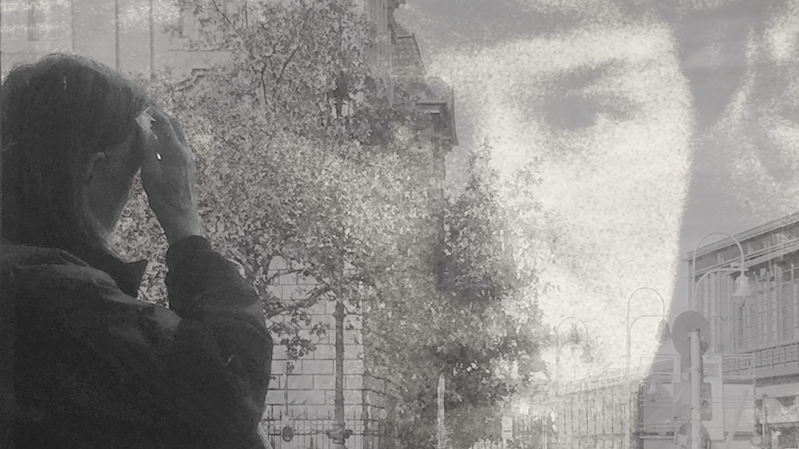

<figure>
    
    <figcaption></figcaption>
</figure>

**ostalgie** | ˈɑstalɡī |

noun

a sentimental longing or wistful affection for life in the former East Germany

----

Ever since I saw a couple of exhibitions at [C|O](http://www.co-berlin.org) on life in the former East Germany, I have been displaying what apparently is already a thing. In other words, I have set myself up as a cliché for waxing nostalgic about a bygone time and place that also had its horrible sides. Here is my defence.

Mine is not really nostalgia, for I never experienced communism anywhere, and certainly not in GDR. Mine is, I believe, a twinge of sadness for the loss of certain qualities that had not been corporatized. I saw what happened even in the three years I lived in San Francisco. All the crazy and the creative people got driven out and a new horde with a new design sensibility took hold. Everything was sanitized. Everything became a monument to computers and software. Everything had the imprint of a 22 year old white kid who could barely keep his espresso down. 

I am seeing the same changes in Berlin. A couple of days ago, on the lovely river, a beautiful evening spoiled by half a dozen powered boats and rafts with beer swilling, loud, obnoxious, young white guys (sadly, almost always *young* and *white* and *guys*), drunk equally on their beer as much as on the number of digits in their salary which makes them believe they are entitled to everyone’s attention. The problem with success is that it makes one believe that one actually is intelligent and deserves it.

Perhaps I sound bitter because two numbers are against me – I am about 20 years older than them and make about $50,000 less. But I don’t think of myself as bitter at all. I just feel sad at the dehumanization that comes from the loss of diversity, from the increasingly mind-numbing sameness sponsored by the next great app that has every bad tech writer breathless.
