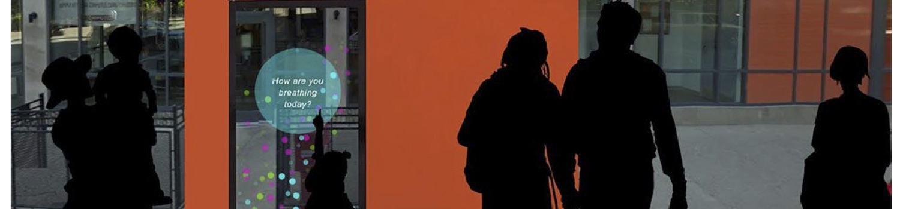

    These content below constitutes a part of the work I did while working as the Manager of Science and Data Policy at Creative Commons. This content is an archive of what used to be on <u>http://science.creativecommons.org/</u> but is no longer available on the web. I have preserved the original content and added more material to them.

<figure>
    
    <figcaption>AirBare by Urban Matter, Inc.</figcaption>
</figure>

<table>
<tbody>

<tr><td colspan="2"><b>ISSUU: Exponential Thinking Issue 5, page 17</b></td></tr>
<tr><td></td><td>Mar 9, 2015: AirBare is a data art project that visualizes data collected from air quality sensors deployed around the city of Louisville. <a href="http://issuu.com/ideas40203/docs/print_exponential_thinking_-_issue__8088a0e6fc0fb1" target="_blank">more &rarr;</a></td></tr>

<tr><td colspan="2"><b>Broken Sidewalk: Seeing is believing: “Air Bare” installation merges pollution data and art to help clear the air in Louisville</b></td></tr>
<tr><td></td><td> Mar 12, 2015: There’s something in the air in Louisville. The city’s air pollution regularly ranks among the nation’s worst, but a new data visualization project by designers in Brooklyn and data scientists in San Francisco launching next week hopes to raise awareness around the issue with a “gamified” public art installation in Downtown Louisville. <a href="http://brokensidewalk.com/2015/air-bare/" target="_blank">more &rarr;</a></td></tr>

<tr><td colspan="2"><b>Louisville Public Media: Telling Stories About Louisville’s Air Quality Through Art</b></td></tr>
<tr><td></td><td>Nov 18, 2014: A new project in Louisville aims to translate environmental data into information that residents can understand and use. It will create and install air quality sensors throughout the city, then incorporate the data from those monitors in a piece of public art. <a href="http://wfpl.org/telling-stories-about-louisvilles-air-quality-through-art/" target="_blank">more &rarr;</a></td></tr>

<tr><td colspan="2"><b>INSIDER Louisville: Using data visualization art to tell Louisville’s air quality story</b></td></tr>
<tr><td></td><td>Nov 19, 2014: Metro government is partnering with City Collaborative, IDEAS40203, Creative Commons, Urban Matter Inc. out of Brooklyn and others to create an interactive, kinetic art installation powered by open data health information. <a href="http://insiderlouisville.com/business/technology-business/using-data-visualization-art-tell-louisvilles-air-quality-story/" target="_blank">more &rarr;</a></td></tr>

</tbody>
</table>