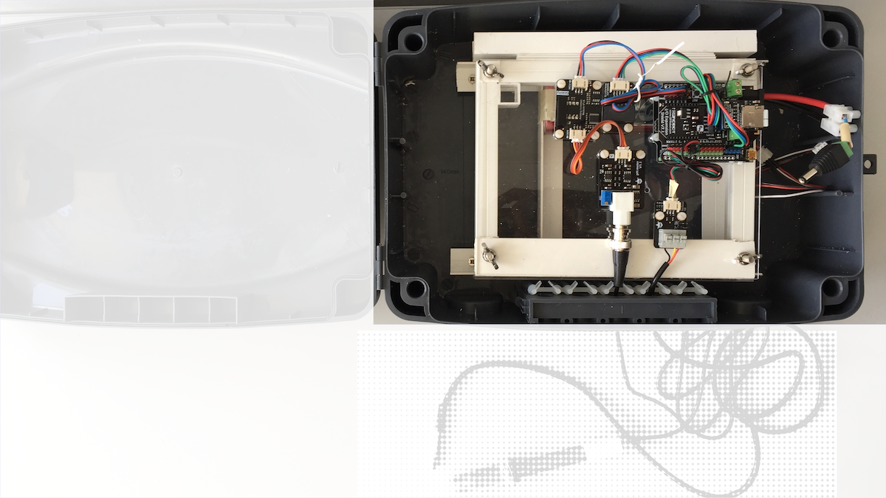
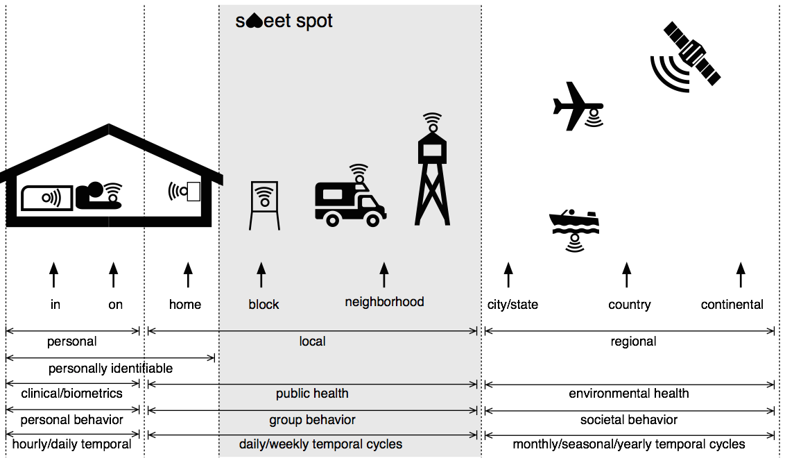

<figure>
    
    <figcaption>Portable water quality sensor developed for the <a href="https://emptygallery.com/exhibitions/eg12_gravitational-currents-the-life-magic/" target="_blank">gravitational currents and the life magic</a> exhibition at the <a href="https://emptygallery.com" target="_blank">Empty Gallery Hong Kong</a> an exhibition of works by <a href="http://www.susannewinterling.com" target="_blank">Susanne Winterling</a>. It is a part of an artistic research project by Susanne that explores <a href="http://web.v-a.pt/planetary-sensing/" target="_blank">planetary sensing navigations</a> below the surface. The device is based on a design by <a href="https://publiclab.org/notes/shanlter/06-08-2017/knowflow-automatic-water-meter" target="_blank">Shan He of Public Lab</a> in cooperation with the folks at <a href="https://www.dfrobot.com" target="_blank">DF Robot</a>. Original design mods and photo released under the <a href="https://creativecommons.org/publicdomain/zero/1.0/" target="_blank">CC0 Public Domain Dedication</a>.</figcaption>
</figure>

## Introduction

Sensors is a generic term for devices, both atomic and composite, that are capable of sensing various external stimuli and acting upon those readings from simply recording them to even reacting to them when a pre-determined threshold is crossed. Typically sensors convert external stimuli to electrical current and then either transmit the data or store it locally. Any device that senses, captures, and reports information can be called a sensor. Sensors can range from nano– to micro–size devices that can be implanted on or even inside the subject (human or non-human) all the way to regional scale sensors such as those installed in satellites.

## Disruptive Power

By being constantly on and providing a continuous stream of real– or near realtime data, sensors disrupt traditional observation systems. By combining sensors with services, more responsive systems can be developed for commercial, humanitarian or environmental uses. For example, cell phones can “sense” and report their locations using global positioning systems (GPS), and businesses can use that information in location-based services to deliver more services. Retailers are experimenting with radio frequency identification (RFID) sensors and other solutions to track the location of customers within stores so they can target promotions and gauge response to merchandising initiatives. The healthcare industry seeks to improve and extend care and reduce cost through remote patient monitoring. The automotive industry is embedding sensors in vehicles and insurance companies are creating usage-based insurance models based on that sensor data. Utilities are deploying smart meters to identify usage trends for things like water and electricity, and helping consumers reduce their utility costs by consuming these commodities during low-demand periods. McKinsey Global Institute reports that more than 30 million networked sensors are in use in the transportation, automotive, industrial, utilities, and retail sectors, and the number is growing by 30 percent annually.

## Potential for Development

Sensor-based delivery systems for plant nutrition can make agriculture more productive and responsive to local conditions. Local-scale sensors form the basis for smart-cities—canopies of PV leaves that generate enough power for local lighting, traffic lights that adjust to traffic volumes reducing idling, pollution monitors that indicate problem spots, drains that phone the public work department when they get clogged, cars that sense potholes and phone the roads dept. with location and depth of the hole, parking meters and spaces that signal availability to a parking map app, windows that become darker like sunglasses when the sun is shining really bright, and conductive paint that can embed circuits in the wall.

## Caveats

The regional-scale sensors such as airborne or satellites will continue to be important, but they are too far away from the humans to provide local detail. Implanted or worn sensors, or even smart-home devices, provide great local detail, but are so fraught with privacy issues that getting that data into a single, global pool is possibly a fool’s errand unless we change the conversation around privacy and sharing. Local sensors have a better chance to not just scale, but also change the way we collect data about ourselves and our local environments with high temporal and spatial resolutions. By not collecting individual info, we sidestep the issues of privacy and security. These local sensors occupy a sweet spot providing useful local detail without getting tied up in privacy issues. Additionally, we can power them however we want, and we already know their position because they are static, so there is no need for battery-consumptive GPS.

<figure>
    
    <figcaption> sweet spot for large-scale sensors use is possible with large geographic scale, short temporal cycles, non-personally identifiable, public health, group behavior as shown above. Original illustration by Puneet Kishor released under the <a href="https://creativecommons.org/publicdomain/zero/1.0/" target="_blank">CC0 Public Domain Dedication</a>.</figcaption>
</figure>

## Resources

    
Smart sensors will detect environmental pollution at the speed of light

    
<iframe width="100%" height="auto" src="https://www.youtube-nocookie.com/embed/8NiVUzKFlzI" frameborder="0" allow="accelerometer; autoplay; encrypted-media; gyroscope; picture-in-picture"></iframe>

    
Environmental pollutants won’t be able to hide thanks to new sensing technologies that accurately pinpoint and monitor the quality of our environment. Together with physical analytics combined with artificial intelligence, these technologies will unlock insights to help us prevent pollution and fully harness the promise of cleaner fuels like natural gas.

    
Real-time Air Quality Monitoring Network Using Low-Cost Devices

    
<iframe width="100%" height="auto" src="https://www.youtube-nocookie.com/embed/82Cw7gi6hF0" frameborder="0" allow="accelerometer; autoplay; encrypted-media; gyroscope; picture-in-picture"></iframe>

    
India has the dubious distinction of having 10 out of the 20 most polluted cities in the world. The number of government air quality monitoring stations in these cities, barring New Delhi (which has 12), are between 1 or 2 stations for a population of 1 to 2 million people. This is woefully inadequate. A new wave of low-cost particulate matter sensors (PM2.5 and PM10 being the most harmful of the air pollutants) enabled with IoT technologies is empowering citizens and communities to participate in their own governance and policy making. IndiaSpend has built India's first independent, real-time air quality monitoring network using indigenously built low-cost IoT devices. The project was launched in December 2015 and is currently active in 6 cities of India (with 10 more cities coming online in the near future). The talk will cover lessons learned from the IoT architecture perspective and the current Fast Time-Series based APIs developed which has enabled a significant enhancement in the accuracy and scalability of the air quality data analysis.

    
Water Quality Sensors

    
<iframe width="100%" height="auto" src="https://www.youtube-nocookie.com/embed/F1DK3IhyZao" frameborder="0" allow="accelerometer; autoplay; encrypted-media; gyroscope; picture-in-picture"></iframe>

    
Junhong Chen, Ph.D., Mechanical Engineering, shows new sensor technology that helps identify contaminants in water. Learn how Milwaukee Engineers' partnerships with industry leaders such as A.O. Smith and Badger Meter acellerates the process of bringing innovative technology from lab to market.

    
<a href="https://distap.mit.edu/research-novel-sensors/" target="_blank">Research: Novel Sensors</a>

    
Plant hormones play a significant role in controlling plant growth and plants’ response to environmental stimuli. The development of nanosensors with high sensitivity would deepen our understanding of the complex plant signaling pathways. Our goal is to generate a library of polymers and discover an optimal CoPhMoRe (Corona Phase Molecular Recognition) sensor for specific plant hormone. Corona phase of SWCNT refers to the phase of the polymer adsorbed around its surface. The recognition takes place by the lateral interactions of the analytes of our interest with the polymer in this corona phase. Depending on the structure of amphiphilic polymers, various kinds of corona phases can be created. Using this property, SWCNT-based sensors can be developed to measure the targeting molecules within the small range of concentration. We aim to study the spatial and temporal distribution of the plants’ signaling pathways in real time and non-destructive manner with high sensitivity.

----

[Back to Disruptive Technologies](/Disruptive-Technologies)