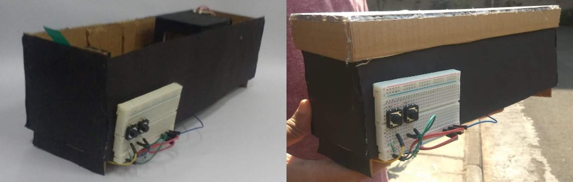
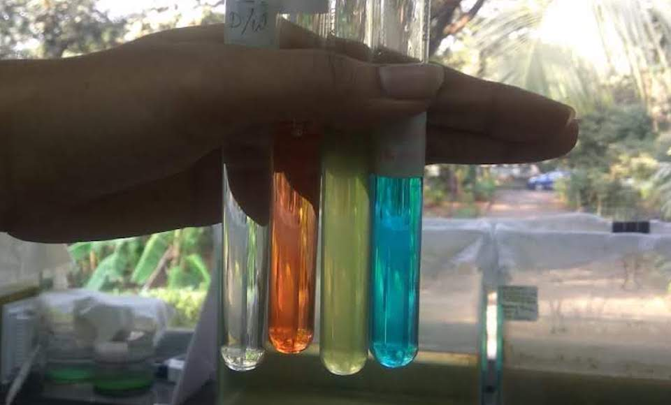

Spectrophotometry is the quantitative measurement of the reflection or transmission properties of a material as a function of wavelength. Light from a white light source is split into its components by a monochromator such as a diffraction grating or a prism and directed to an exit slit. Beyond the slit, the selected light color passes through a cuvette holding the test sample and falls on a photo-receptor that allows calculating the absorbance via the Lambert-Beer equation A = -Log10(I1/I0). 

<i><b>Note:</b> The first version of the spectrophotometer was made by Ashish and Ravi with help from GN and I. Shirish, Praveen and Ankush provided valuable advice.</i>

<figure>
    
    <figcaption>spectrophotometer</figcaption>
</figure>

<figure>
    
    <figcaption>side views with stepper motor control buttons</figcaption>
</figure>

<figure>
    
    <figcaption>view from top, front-to-back and back-to-front</figcaption>
</figure>

<figure>
    
    <figcaption>solutions</figcaption>
</figure>

<figure>
    
    <figcaption>waveforms</figcaption>
</figure>