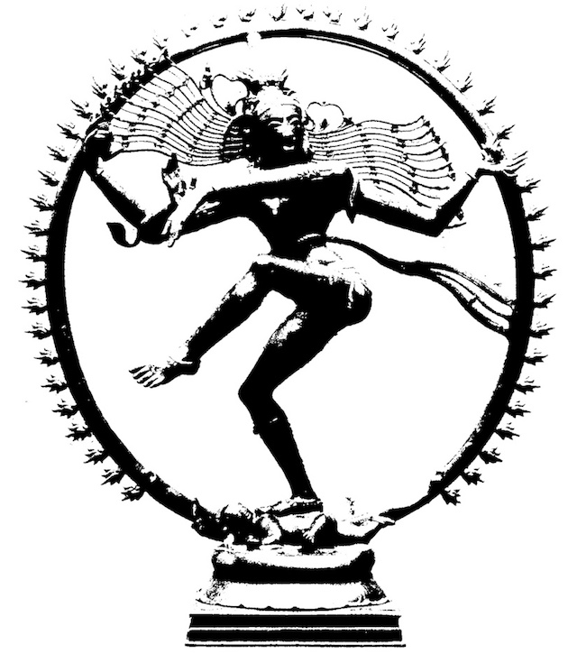

<figure>
    
    <figcaption>Shiva</figcaption>
</figure>

Of you who has walked on this path before 
With rays of sun on dappled blades of grass 
I cannot ask but I must ask for more 
Lest flashes of life in a flash do pass 
 
Round as welkin orbs that hang are round 
By force they spin an endless cosmic dance 
Where squares are none for squares are seldom found 
And edges fade and blur in prose askance 
 
Two steps we march in step and find a cause 
For fate has played its hand in full conceit 
To make what one will be from what once was 
Like lines that are aligned but never meet 
 
So hold my hand and live this life sublime 
Ere time doth steal us let us steal the time 
 

