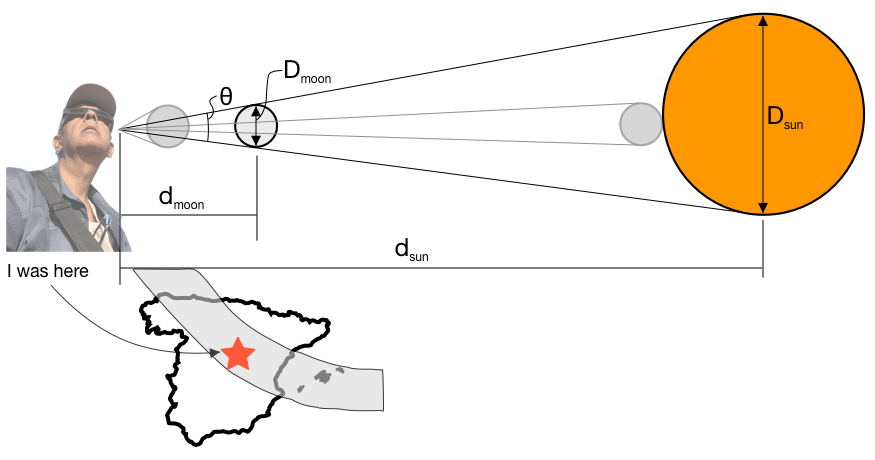

*To the young astronomer who wondered how we knew the names of all the stars[^1]*

Things that are far appear smaller than they are. As they get closer, they appear bigger and bigger. To these two assertions, there should be no opposition, and no further explanation is required.

This leads us to believe that a small thing closer to us can completely obscure a large thing farther away. All I have to do is to raise my roughly 20 cms wide hand to completely the hide the sun that is waaaay larger.

So, at what distance from us would a thing of one size completely hide another thing of a different size? Turns out, there is really easy math behind it.

A circle is 360º. It is also 2π radians. Just like a degree is 1/360 of a circle, a radian is 1÷2π. Very precisely, the length of an arc of a circle divided by the radius of the circle gives us the angle in radians subtended at the center of the circle. 

It is clear from the diagram below that for the moon to hide the sun exactly from our view, the angle θ subtended at our eye should be exactly the same for both the moon and the sun. Since the sun and the moon are very far away from us, we can assume that θ in radians created by them is roughly equal to their diameter divided by their distance from us. Or Dmoon/dmoon = Dsun/dsun.

<figure>
    
    <figcaption>sun, moon, and me</figcaption>
</figure>

Well, it just so happens that the dsun = 149.6x106 kms, Dsun = 1.39x106 kms so its θ in radians is 0.00929, and dmoon = 384400 kms and Dmoon = 3475 kms so its θ in radians is 0.00904. Close enough! How is that for a coincidence? 

A bit of rearranging, and we see that Dsun/Dmoon = dsun/dmoon. The sun’s diameter is 400 times that of the moon, and you mean to tell me that the sun also happens to be 400 times farther away from us than the moon? Yup.

To paraphrase Arthur C. Clark, any sufficiently advanced science is indistinguishable from magic. Yesterday, I saw magic that I will likely never see again in my life.

[^1]: I remember reading this <i>faux</i> dedication on the back of a book, but I can’t, for the life me, remember which book it was. But, it does seem apt for the thoughts that follow.