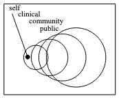

Though [the sweet spot for sensors](Taxonomy-of-Sensors) probably remains outside "personal," there may be use for personal data in the four general spheres of health:

<!--
* self
* clinical
* community
* public
-->

The following are my empirical generalizations from the [QSPH summit at UCSD early April](http://quantifiedself.com/symposium/Symposium-2014/). 

* Most people are not interested in quantifying themselves.
* Measuring oneself will remain of interest as a novelty, or to those who need the measures, that is, folks training for an event, or faced with a condition that requires monitoring, either doing so themselves or because their doctor asked them.
* Fragmented tech landscape means none of them will reach scale.
* Silo-fication means users are faced with the onerous task of wearing multiple trackers that don't talk to each other and thus provide an incomplete or incoherent view.
* There are signs [people][0] and [manufacturers][1] may already be [tiring][3] of wearables
* The wearables market is just [not as big as the smartphone][2] market
* Perhaps the move will be toward [software and services that coalesce around smartphone-based apps][4] such as [RunKeeper's new Breeze app][7] and [Moves app][6] that announced "the launch of Moves 2.0 for the iPhone… (bringing) with it [support for Apple’s M7 motion coprocessor][6] in the iPhone 5s for increased tracking accuracy and a new battery saving mode for an increase of up to 40% in battery life." 
* Integration into other platforms such as [Moves being acquired by Facebook][5]
* Doctors are not interested in continuous data collection. Clinical utility of data is episodic and individualized. ([National Research Council. *Computational Technology for Effective Health Care: Immediate Steps and Strategic Directions.* Washington, DC: The National Academies Press, 2009.][8])
* Clinicians don't need all the data from everyone all the time. They need *specific data* from *specific people* at *specific times* for *specific duration*.
* Decouple acquisition of data from delivery of intervention.

[0]: http://www.theguardian.com/technology/2014/apr/01/wearables-consumers-abandoning-devices-galaxy-gear
[1]: http://www.cnet.com/news/is-nike-fuelband-out-of-gas-already/
[2]: http://www.macworld.com/article/2142568/iwatch-watch-apple-is-not-here-to-entertain-you.html
[3]: http://www.cnet.com/news/end-of-fitness-bands-future-after-nike-fuelband/
[4]: http://www.cnet.com/news/nike-fires-fuelband-engineers-will-stop-making-wearable-hardware/
[5]: http://www.moves-app.com/press
[6]: http://www.moves-app.com/press/moves2-launch
[7]: http://appleinsider.com/articles/14/04/17/runkeepers-new-breeze-app-goes-beyond-workouts-to-count-daily-steps-via-apples-m7-chip-in-iphone-5s
[8]: http://www.nap.edu/catalog.php?record_id=12572

Individual-level data could be useful for self– and clinical-care, and aggregate data for community– and public-health. But significant questions and challenges remain along the entire [information lifecycle](Information-Lifecycle).
