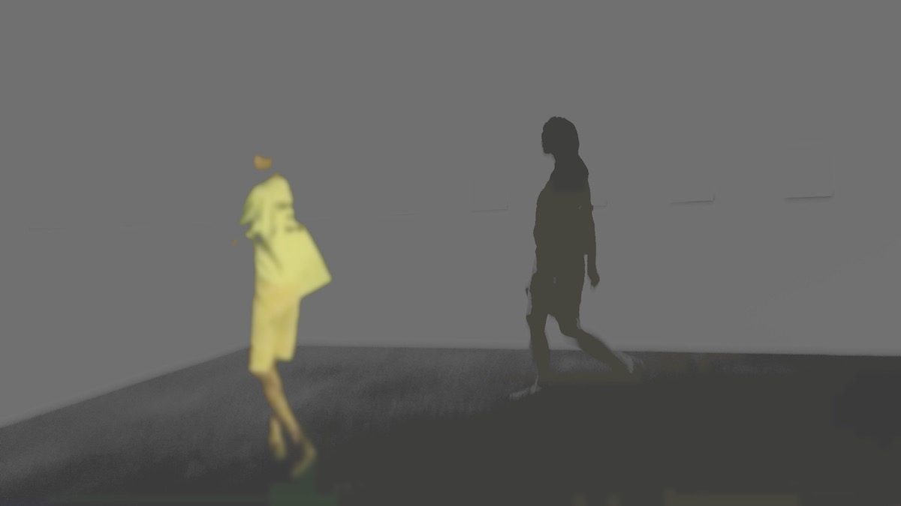

<figure>
    
    <figcaption>within, without</figcaption>
</figure>

Well, you won’t believe what happened last night – a virgin spat at my face violently just after she had finished eating a salad of elderberry flowers garnished with St. John’s Wort on which a crow had dribbled right before dying. The spell started fading and I realized everything had been an illusion. In India there is a saying:

राम तेरी माया  
कहीं धूप कहीं छाया

Some things can only be experienced, not understood. Just the like the wonderous power and illusion of (Lord) Ram, the image in my mind may fade with time but the image left on my heart will remain, and whatever I am will be partly a result of it. It is just like that.
