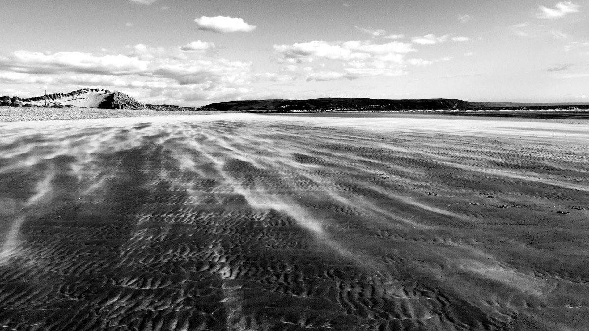

<figure>
    
    <figcaption>Ynyslas</figcaption>
</figure>

I've been sitting on this photo for almost eight months since I took it on a really windy day on the shores of the Cardigan Bay. From the wikipedia, 

> Ynyslas is a small Welsh village about 1.5 miles north of Borth and 8 miles north of Aberystwyth, within the county of Ceredigion. It is sandwiched between a long sandy beach in Cardigan Bay and the beach in the Dyfi Estuary. [more on Wikipedia](http://en.wikipedia.org/wiki)
